# دراسة مشروع التخرج

## نظام بصيرة — منصة تعليمية صوتية للمكفوفين

---


| البند                 | التفاصيل                                                   |
| --------------------- | ---------------------------------------------------------- |
| **اسم المشروع**       | بصيرة (Basera)                                             |
| **نوع المشروع**       | مشروع تخرج — تطبيق جوال مع خادم خلفي                       |
| **التقنيات**          | Flutter (واجهة أمامية) + Django REST Framework (خادم خلفي) |
| **الفئة المستهدفة**   | المكفوفين كلياً من عمر 14 سنة فما فوق                      |
| **المراحل التعليمية** | من الصف التاسع حتى التعليم الجامعي                         |


---

## فهرس المحتويات

1. [الملخص التنفيذي](#1-الملخص-التنفيذي)
2. [المقدمة](#2-المقدمة)
3. [تحليل المشكلة](#3-تحليل-المشكلة)
4. [أهداف المشروع](#4-أهداف-المشروع)
5. [دراسة الأنظمة المشابهة](#5-دراسة-الأنظمة-المشابهة)
6. [تحليل المتطلبات](#6-تحليل-المتطلبات)
7. [تحليل أصحاب المصلحة](#7-تحليل-أصحاب-المصلحة)
8. [حالات الاستخدام](#8-حالات-الاستخدام)
9. [تحليل النظام](#9-تحليل-النظام)
10. [تصميم النظام](#10-تصميم-النظام)
11. [مخطط الكيانات والعلاقات (ERD)](#11-مخطط-الكيانات-والعلاقات-erd)
12. [مخططات UML](#12-مخططات-uml)
13. [مخططات التدفق والنشاط](#13-مخططات-التدفق-والنشاط)
14. [تصميم واجهات البرمجة (API)](#14-تصميم-واجهات-البرمجة-api)
15. [البنية البرمجية للمشروع](#15-البنية-البرمجية-للمشروع)
16. [التقنيات والأدوات](#16-التقنيات-والأدوات)
17. [إمكانية الوصول والأمان](#17-إمكانية-الوصول-والأمان)
18. [خطة الاختبار](#18-خطة-الاختبار)
19. [خطة التنفيذ والجدول الزمني](#19-خطة-التنفيذ-والجدول-الزمني)
20. [القيود والتحديات](#20-القيود-والتحديات)
21. [الأعمال المستقبلية](#21-الأعمال-المستقبلية)
22. [الخلاصة](#22-الخلاصة)
23. [المراجع](#23-المراجع)
24. [الملاحق](#24-الملاحق)

---


## 1. الملخص التنفيذي

**بصيرة** هو نظام تعليمي رقمي يهدف إلى تمكين الطلاب المكفوفين من الوصول إلى محتوى تعليمي منظم عبر **التفاعل الصوتي الكامل**، دون الاعتماد على العناصر البصرية في الشاشة. يجمع المشروع بين تطبيق جوال (Flutter) يدعم التحويل من صوت إلى نص (STT) والقراءة الصوتية (TTS) والتنقل بالأوامر الصوتية، وخادم خلفي (Django) يدير المحتوى التعليمي الهرمي، تتبع التقدم، الاختبارات الصوتية، ودور المتطوعين في مراجعة المحتوى.

يُعالج المشروع فجوة واضحة: غياب منصات تعليمية عربية شاملة مصممة **من الأساس** للمكفوفين، وليس مجرد إضافة قارئ شاشة لتطبيقات بصرية. يعتمد الحل على مكتبة صوتية هرمية (صف → مادة → درس)، اختبارات صوتية، ونظام متطوعين لضمان جودة التفريغ والمحتوى.

---


## 2. المقدمة


### 2.1 خلفية الموضوع

التعليم الرقمي شهد توسعاً كبيراً، لكن المحتوى التعليمي العربي الموجّه للمكفوفين يبقى محدوداً. معظم التطبيقات التعليمية مبنية لفرضية **الإبصار**: نصوص، صور، فيديو، وواجهات لمس بصرية. المكفوفون يعتمدون على قارئات الشاشة (TalkBack / VoiceOver) كحلّ ترقيعي، ما يُنتج تجربة أبطأ وأقل سلاسة.

المكفوفون يحتاجون إلى:

- محتوى **مسموع** أو قابل للقراءة آلياً بجودة عالية.
- **تنقل صوتي** دون الحاجة لاستكشاف الشاشة باللمس.
- **تقييم** عبر اختبارات تدعم الإجابة الصوتية.
- **مجتمع متطوعين** لمراجعة التفريغ وإثراء المحتوى.


### 2.2 فكرة المشروع

**بصيرة** (بمعنى البصيرة والإدراك) منصة تجمع:

1. مكتبة دروس منظمة حسب الصف والمادة.
2. تحويل المحتوى (PDF / نص / صوت) إلى تجربة استماع.
3. أوامر صوتية للتنقل والبحث.
4. اختبارات مع تصحيح آلي ومراجعة بشرية.
5. لوحة متطوعين لمراجعة التفريغ ورفع تسجيلات جديدة.


### 2.3 نطاق المشروع


| ضمن النطاق                    | خارج النطاق (حالياً)                        |
| ----------------------------- | ------------------------------------------- |
| تطبيق Android/iOS عبر Flutter | تطبيق ويب كامل للطلاب                       |
| API REST للمحتوى والمصادقة    | نظام دفع أو اشتراكات                        |
| إدارة صفوف ومواد ودروس        | منصة مؤتمرات فيديو حية                      |
| اختبارات صوتية ونصية          | ذكاء اصطناعي متقدم للتلخيص (مخطط مستقبلياً) |
| أدوار المتطوعين               | تطبيق سطح مكتب منفصل                        |


---


## 3. تحليل المشكلة


### 3.1 وصف المشكلة

الطلاب المكفوفون في المراحل الثانوية والجامعية يواجهون:

- **صعوبة الوصول** للكتب والملخصات بصيغة صوتية منظمة.
- **بطء التعلم** عند استخدام تطبيقات غير مخصصة مع قارئ الشاشة.
- **غياب التقييم الذاتي** عبر اختبارات تفاعلية صوتية.
- **اعتماداً كبيراً** على معلمين أو متطوعين بشكل غير منظم.


### 3.2 تحليل SWOT


| **نقاط القوة (S)**                 | **نقاط الضعف (W)**                             |
| ---------------------------------- | ---------------------------------------------- |
| تصميم صوتي أولاً (Audio-first)     | يعتمد على جودة محركات STT/TTS للعربية          |
| مفتوح المصدر وقابل للتوسع          | يحتاج متطوعين لمراجعة المحتوى                  |
| بنية هرمية واضحة للمحتوى           | العمل دون إنترنت غير مكتمل بعد                 |
| دعم إمكانية الوصول (Accessibility) | ازدواجية نماذج اختبار في الكود (انظر الملحق أ) |


| **الفرص (O)**              | **التهديدات (T)**              |
| -------------------------- | ------------------------------ |
| شراكات مع جمعيات المكفوفين | منافسة تطبيقات عالمية          |
| تكامل Whisper و AI للتلخيص | تكلفة استضافة الملفات الصوتية  |
| توسع للمناهج الرسمية       | تغيّر سياسات المتاجر للتطبيقات |


### 3.3 لماذا الحل المقترح مناسب؟

الحل يجمع **تخصصاً في الفئة المستهدفة** (وليس تطبيقاً عاماً) مع **بنية تقنية حديثة** (Flutter + Django) تسمح بالتطوير السريع والصيانة، و**نموذج مجتمعي** (متطوعون) يضمن استدامة المحتوى دون الاعتماد الكامل على التلقائية.

---


## 4. أهداف المشروع


### 4.1 الهدف العام

بناء منصة تعليمية صوتية متكاملة تمكّن المكفوفين من التعلم الذاتي المنظم عبر الهاتف المحمول.

### 4.2 الأهداف التفصيلية


| #   | الهدف                                    | مؤشر النجاح                                 |
| --- | ---------------------------------------- | ------------------------------------------- |
| 1   | توفير مكتبة دروس هرمية (صف → مادة → درس) | عرض وتصفح صوتي للتصنيفات                    |
| 2   | دعم الاستماع والتنقل الصوتي              | تنفيذ أوامر: التالي، السابق، أعد، توقف      |
| 3   | تتبع تقدم الطالب                         | حفظ الموضع ووقت الاستماع لكل درس            |
| 4   | اختبارات صوتية مع تقييم                  | تصحيح آلي للموضوعية + مراجعة للمفتوحة       |
| 5   | إشراك المتطوعين                          | مراجعة تفريغ، رفع تسجيلات، أدوار متعددة     |
| 6   | تحويل PDF/نص إلى صوت                     | حالة تحويل (conversion_status) وتقدم النسبة |
| 7   | إمكانية وصول عالية                       | توافق TalkBack/VoiceOver وأزرار كبيرة       |


---


## 5. دراسة الأنظمة المشابهة


| النظام / الفئة                      | الوصف                              | نقاط القوة        | نقاط الضعف مقارنة ببصيرة         |
| ----------------------------------- | ---------------------------------- | ----------------- | -------------------------------- |
| تطبيقات قارئ الشاشة + مواقع تعليمية | استخدام الويب التقليدي مع TalkBack | محتوى واسع        | غير مصممة صوتياً؛ تجربة بطيئة    |
| تطبيقات كتب صوتية (Audible وغيرها)  | استماع لكتب                        | جودة صوت          | غير تعليمية تفاعلية؛ لا اختبارات |
| منصات تعليم عن بعد (عامة)           | فيديو ونص                          | مناهج جاهزة       | تعتمد البصر؛ ضعيفة للمكفوفين     |
| تطبيقات قرآن/تجويد صوتية            | متخصصة صوتياً                      | ناجحة في مجال ضيق | لا تغطي مناهج مدرسية شاملة       |
| **بصيرة (المقترح)**                 | تعليم صوتي + اختبارات + متطوعون    | شمولية وتخصص      | يحتاج بناء قاعدة محتوى           |


**التميز التنافسي لبصيرة:** التصميم الصوتي أولاً، الهيكل التعليمي (صفوف ومناهج)، الاختبارات الصوتية، ونظام المتطوعين في منظومة واحدة.

---


## 6. تحليل المتطلبات


### 6.1 المتطلبات الوظيفية (Functional Requirements)


| الرمز | المتطلب                                | الأولوية |
| ----- | -------------------------------------- | -------- |
| FR-01 | تسجيل مستخدم جديد (طالب / متطوع)       | عالية    |
| FR-02 | تسجيل الدخول والحصول على ملف شخصي      | عالية    |
| FR-03 | عرض الصفوف الدراسية والمواد والدروس    | عالية    |
| FR-04 | تشغيل الدرس صوتياً (ملف أو TTS)        | عالية    |
| FR-05 | التنقل بين أقسام الدرس صوتياً          | عالية    |
| FR-06 | حفظ موضع الاستماع ووقت الاستماع        | عالية    |
| FR-07 | البحث في المحتوى (نصي/صوتي)            | متوسطة   |
| FR-08 | بدء محاولة اختبار وإرسال إجابات        | عالية    |
| FR-09 | تصحيح تلقائي لأسئلة الاختيار وصح/خطأ   | عالية    |
| FR-10 | مراجعة متطوع للإجابات المفتوحة/الصوتية | عالية    |
| FR-11 | رفع ومراجعة تفريغ الدروس               | عالية    |
| FR-12 | رفع تسجيل صوتي من متطوع                | متوسطة   |
| FR-13 | استخراج نص من PDF وتحويله لصوت         | متوسطة   |
| FR-14 | تلخيص درس (حقل summary)                | منخفضة   |
| FR-15 | إدارة أدوار المتطوعين حسب المادة       | متوسطة   |


### 6.2 المتطلبات غير الوظيفية (Non-Functional Requirements)


| الرمز  | المتطلب             | المعيار المقترح                                                |
| ------ | ------------------- | -------------------------------------------------------------- |
| NFR-01 | **إمكانية الوصول**  | WCAG 2.1 مستوى AA حيث ينطبق                                    |
| NFR-02 | **الأداء**          | استجابة API < 2 ثانية للقوائم                                  |
| NFR-03 | **الأمان**          | Token authentication؛ HTTPS في الإنتاج                         |
| NFR-04 | **قابلية التوسع**   | فصل Frontend/Backend؛ قاعدة بيانات قابلة للترقية لـ PostgreSQL |
| NFR-05 | **الموثوقية**       | تتبع حالة فشل التحويل (conversion_error)                       |
| NFR-06 | **قابلية الصيانة**  | تطبيقات Django منفصلة (core, lessons, tests, volunteers)       |
| NFR-07 | **دعم العربية**     | واجهات ونماذج بأسماء عربية (verbose_name)                      |
| NFR-08 | **العمل دون اتصال** | تخزين محلي (Hive) — مخطط توسعه                                 |


---


## 7. تحليل أصحاب المصلحة

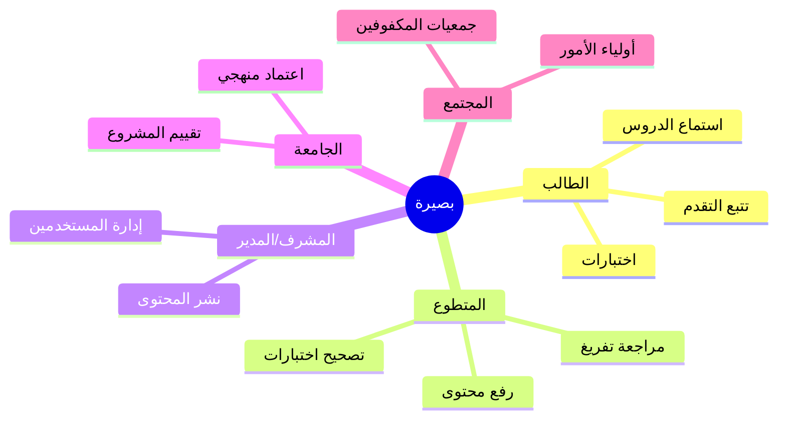


| صاحب المصلحة       | الدور         | الاحتياجات               |
| ------------------ | ------------- | ------------------------ |
| **الطالب المكفوف** | مستخدم أساسي  | تعلم ذاتي، صوت، بساطة    |
| **المتطوع**        | إنتاج ومراجعة | واجهة مراجعة، مهام واضحة |
| **مدير النظام**    | إدارة         | لوحة Django Admin        |
| **لجنة التخرج**    | تقييم         | وثائق، عرض، اختبارات     |
| **مؤسسة تعليمية**  | محتوى         | مناهج مطابقة للصفوف      |


---


## 8. حالات الاستخدام


### 8.1 مخطط حالات الاستخدام (Use Case Diagram)

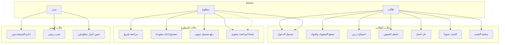


### 8.2 جدول حالات الاستخدام التفصيلية


#### UC-03: استماع درس


| البند              | الوصف                                                                                                                         |
| ------------------ | ----------------------------------------------------------------------------------------------------------------------------- |
| **الممثل**         | طالب                                                                                                                          |
| **الشرط المسبق**   | مسجل دخول؛ الدرس منشور (published)                                                                                            |
| **التدفق الرئيسي** | 1. يختار صفاً → مادة → درس. 2. يبدأ التشغيل الصوتي. 3. النظام يحدّث LessonProgress. 4. يستخدم أوامر صوتية للتنقل بين الأقسام. |
| **التدفق البديل**  | لا يوجد ملف صوتي → قراءة TTS من transcribed_text أو text_content                                                              |
| **الشرط اللاحق**   | حفظ current_position و listening_time_seconds                                                                                 |
| **الاستثناء**      | انقطاع الشبكة → تشغيل من التخزين المحلي (مستقبلي)                                                                             |


#### UC-05: حل اختبار صوتي


| البند              | الوصف                                                                                                               |
| ------------------ | ------------------------------------------------------------------------------------------------------------------- |
| **الممثل**         | طالب                                                                                                                |
| **الشرط المسبق**   | اختبار نشط؛ لم يتجاوز max_attempts                                                                                  |
| **التدفق الرئيسي** | 1. start_attempt. 2. قراءة السؤال صوتياً. 3. إرسال إجابة (نص/صوت/اختيار). 4. submit_attempt. 5. عرض النتيجة صوتياً. |
| **التدفق البديل**  | سؤال مفتوح → needs_review=true حتى يراجع متطوع                                                                      |
| **الشرط اللاحق**   | تحديث QuizAttempt: score, percentage, passed                                                                        |


#### UC-08: مراجعة تفريغ


| البند              | الوصف                                                                                                                          |
| ------------------ | ------------------------------------------------------------------------------------------------------------------------------ |
| **الممثل**         | متطوع (دور transcriber أو reviewer)                                                                                            |
| **التدفق الرئيسي** | 1. يفتح درساً بحالة review. 2. يعدّل transcribed_text. 3. يسجل TranscriptionReview. 4. يحدّث حالة الدرس إلى approved/published |


---


## 9. تحليل النظام


### 9.1 نموذج العمل (Business Model)

يعتمد المشروع على **نموذج مجتمعي + تقني**:

1. **إدخال المحتوى:** PDF / نص / تسجيل صوتي.
2. **المعالجة:** استخراج نص (PyPDF2/pdfplumber) → تفريغ (Whisper اختياري) → TTS (gTTS).
3. **المراجعة البشرية:** متطوعون يعتمدون النص.
4. **النشر:** حالة الدرس published.
5. **الاستهلاك:** طالب يستمع ويختبر.
6. **التقييم:** آلي + مراجعة متطوع.


### 9.2 سير عمل المحتوى (Content Lifecycle)

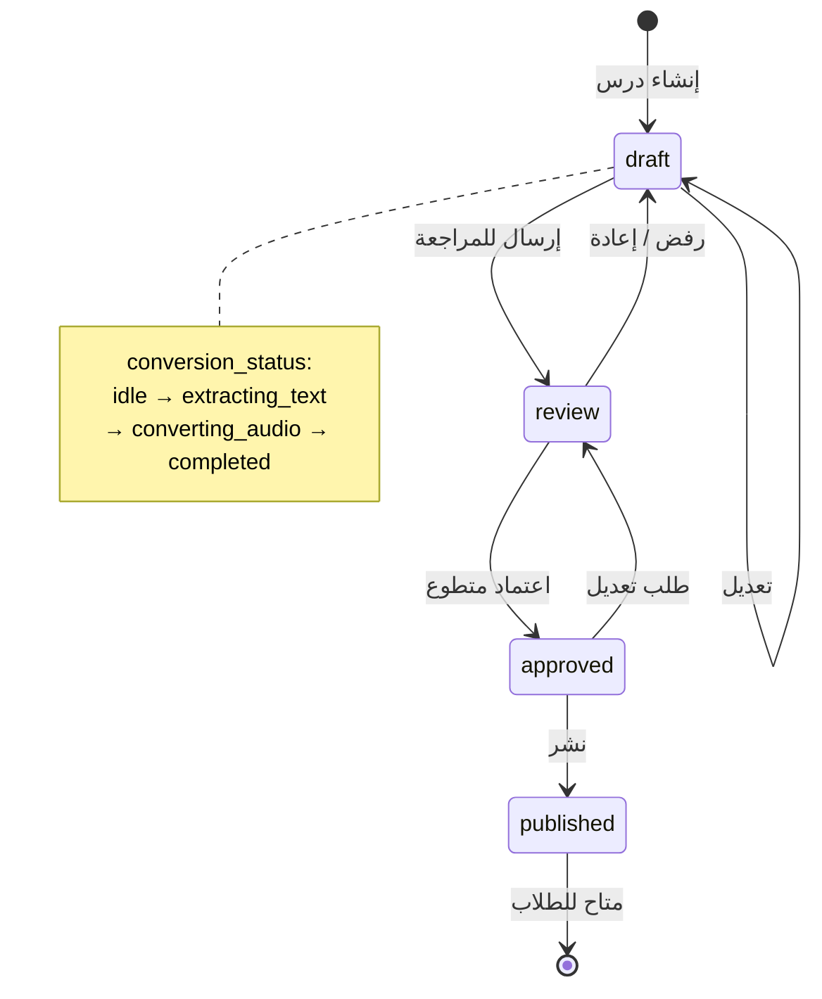


### 9.3 سير عمل التحويل (PDF/نص → صوت)

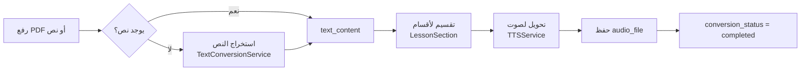


### 9.4 تحليل البيانات الهرمية

```
Grade (الصف الدراسي)
 └── Category (المادة الدراسية)
      ├── Lesson (الدرس)
      │    ├── LessonSection (فقرات / عناوين / نقاط)
      │    └── LessonProgress (تقدم الطالب)
      ├── Quiz (الاختبار)
      │    ├── Question
      │    │    └── QuestionChoice
      │    └── QuizAttempt
      │         └── Answer
      └── VolunteerRole (متطوع مرتبط بمادة)
```

---


## 10. تصميم النظام


### 10.1 البنية المعمارية (Architecture)

يتبع المشروع نمط **Client-Server** مع **طبقات منفصلة**:

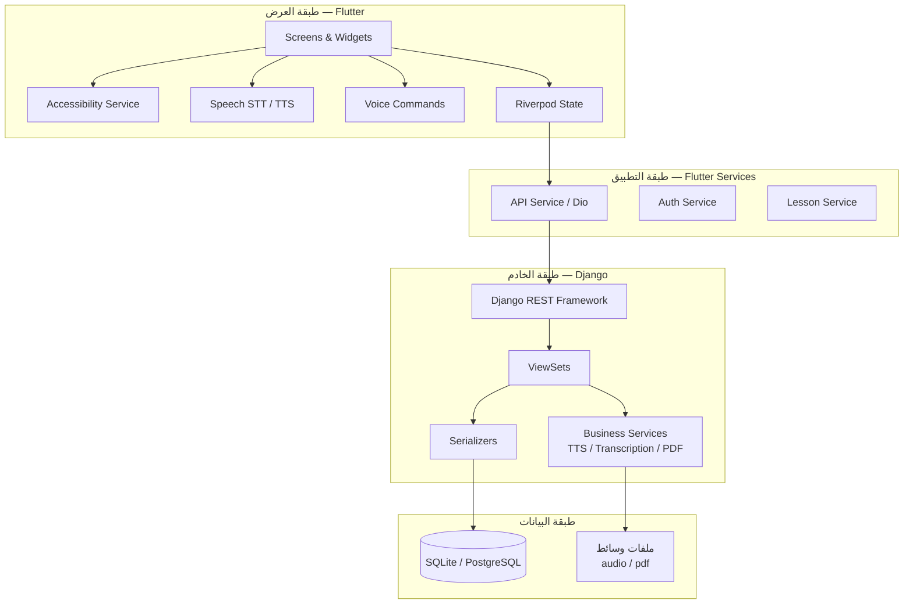


### 10.2 مخطط المكونات (Component Diagram)

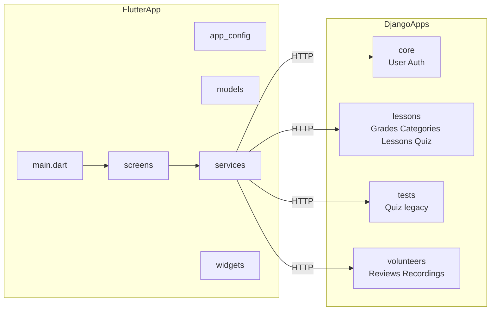


### 10.3 النشر (Deployment Diagram)

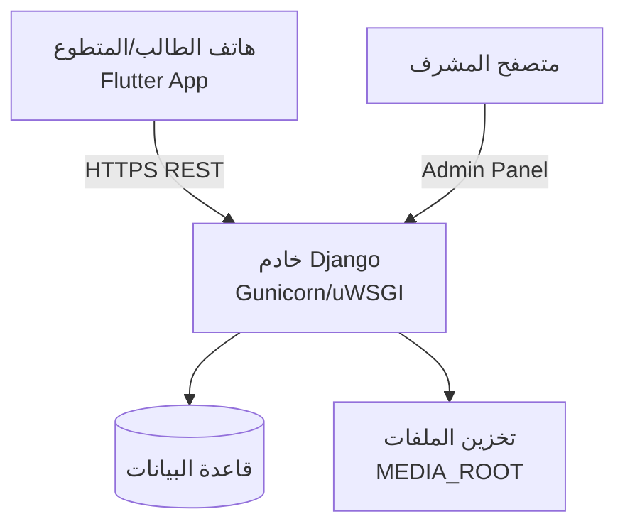


---


## 11. مخطط الكيانات والعلاقات (ERD)


### 11.1 الكيانات الرئيسية


#### كيان المستخدم (User) — تطبيق `core`


| الحقل                     | النوع    | الوصف                       |
| ------------------------- | -------- | --------------------------- |
| id                        | PK       | معرف                        |
| username, email, password | —        | مصادقة Django               |
| user_type                 | enum     | student / volunteer / admin |
| phone_number              | string   | اختياري                     |
| created_at, updated_at    | datetime | تتبع                        |


#### كيان الصف (Grade)


| الحقل       | النوع  | الوصف       |
| ----------- | ------ | ----------- |
| id          | PK     |             |
| name        | string | اسم الصف    |
| description | text   |             |
| order       | int    | ترتيب العرض |
| is_active   | bool   |             |


#### كيان المادة (Category)


| الحقل                   | النوع      | الوصف |
| ----------------------- | ---------- | ----- |
| id                      | PK         |       |
| grade_id                | FK → Grade |       |
| name, description, icon |            |       |
| order, is_active        |            |       |


#### كيان الدرس (Lesson)


| الحقل                                  | النوع         | الوصف           |
| -------------------------------------- | ------------- | --------------- |
| id                                     | PK            |                 |
| category_id                            | FK → Category |                 |
| title, description                     |               |                 |
| audio_file, pdf_file                   | file          |                 |
| text_content, transcribed_text         | text          |                 |
| transcribed_text_reviewed              | bool          |                 |
| conversion_status, conversion_progress |               | تتبع التحويل    |
| duration, status                       |               | draft…published |
| created_by, reviewed_by                | FK → User     |                 |
| summary                                | text          | ملخص            |


#### كيان قسم الدرس (LessonSection)


| الحقل                        | النوع                       |
| ---------------------------- | --------------------------- |
| lesson_id                    | FK                          |
| section_type                 | paragraph / heading / point |
| text, order, audio_timestamp |                             |


#### كيان تقدم الدرس (LessonProgress)


| الحقل                       | النوع                |
| --------------------------- | -------------------- |
| user_id, lesson_id          | FK (unique together) |
| completed, current_position |                      |
| listening_time_seconds      |                      |


#### كيان الاختبار (Quiz) — في `lessons`


| الحقل                                         | النوع                  |
| --------------------------------------------- | ---------------------- |
| category_id, lesson_id                        | FK                     |
| quiz_type                                     | practice / exam / quiz |
| duration_minutes, passing_score, max_attempts |                        |
| status, is_active                             |                        |


#### كيان السؤال (Question) والخيار (QuestionChoice)


| Question                              | QuestionChoice                       |
| ------------------------------------- | ------------------------------------ |
| quiz_id, question_text, question_type | question_id, choice_text, is_correct |
| points, correct_answer                | order                                |


#### كيان المحاولة (QuizAttempt) والإجابة (Answer)


| QuizAttempt               | Answer                                     |
| ------------------------- | ------------------------------------------ |
| user_id, quiz_id, status  | attempt_id, question_id                    |
| score, percentage, passed | answer_text, selected_choice, answer_audio |
| time_taken_minutes        | is_correct, needs_review                   |


#### كيان دور المتطوع (VolunteerRole)


| الحقل                              | النوع                                                            |
| ---------------------------------- | ---------------------------------------------------------------- |
| user_id, role                      | reviewer / transcriber / quiz_reviewer / content_creator / admin |
| category_id                        | اختياري                                                          |
| tasks_completed, tasks_in_progress |                                                                  |


#### كيانات المتطوعين — تطبيق `volunteers`


| TranscriptionReview    | AudioRecording                 |
| ---------------------- | ------------------------------ |
| lesson_id, reviewer_id | title, audio_file, recorded_by |
| reviewed_text, status  | status: pending → published    |
| comments               | transcribed_text, notes        |


### 11.2 مخطط ERD (Mermaid)

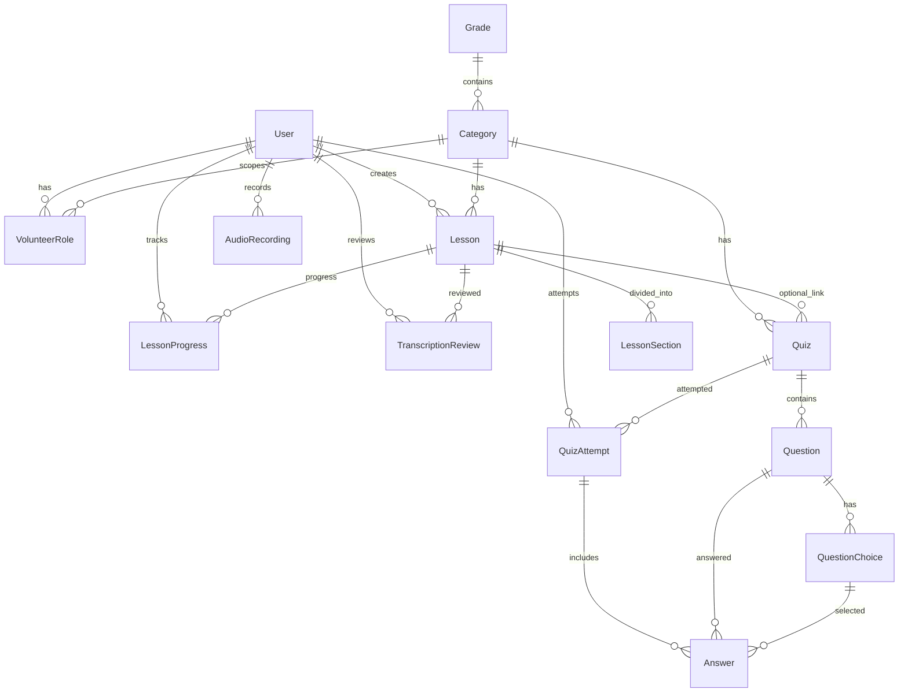


### 11.3 قاموس البيانات (Data Dictionary) — ملخص العلاقات


| العلاقة                          | النوع | القيود                     |
| -------------------------------- | ----- | -------------------------- |
| Grade → Category                 | 1:N   | on delete CASCADE          |
| Category → Lesson                | 1:N   |                            |
| Lesson → LessonSection           | 1:N   | ترتيب بـ order             |
| User + Lesson → LessonProgress   | N:M   | unique_together            |
| Quiz → Question → QuestionChoice | 1:N:N |                            |
| QuizAttempt → Answer             | 1:N   | unique (attempt, question) |


---


## 12. مخططات UML


### 12.1 مخطط الفئات (Class Diagram) — منطق المجال

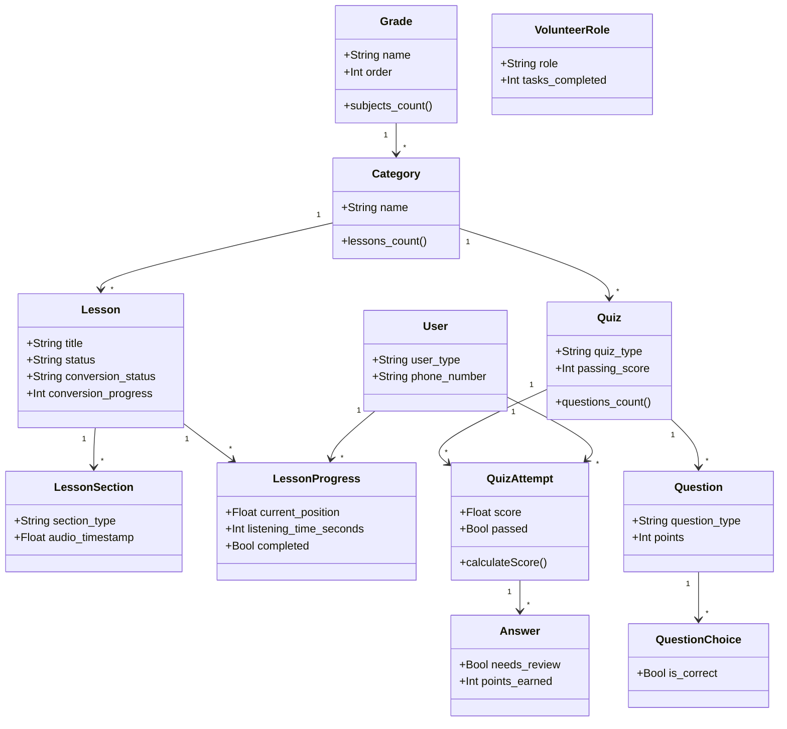


### 12.2 مخطط تسلسل — تسجيل الدخول واستماع درس

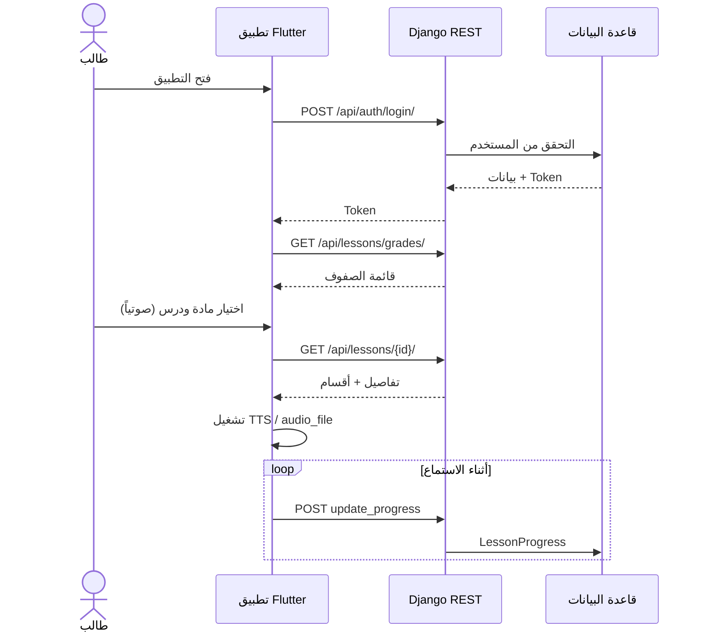


### 12.3 مخطط تسلسل — إنهاء اختبار

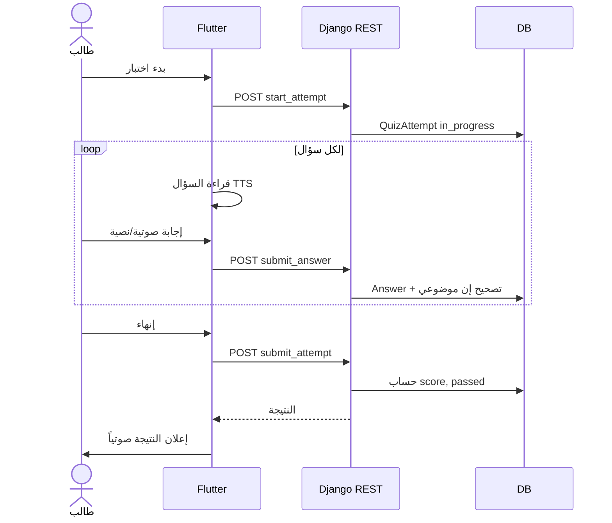


### 12.4 مخطط تسلسل — مراجعة متطوع

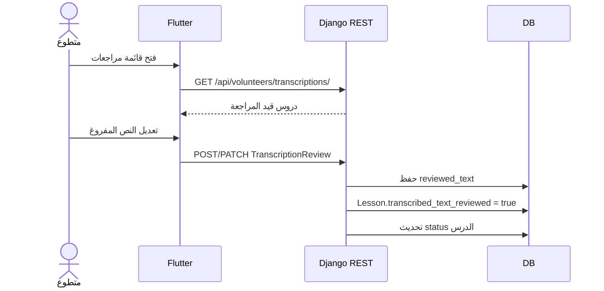


---


## 13. مخططات التدفق والنشاط


### 13.1 مخطط تدفق البيانات (DFD) — المستوى 0

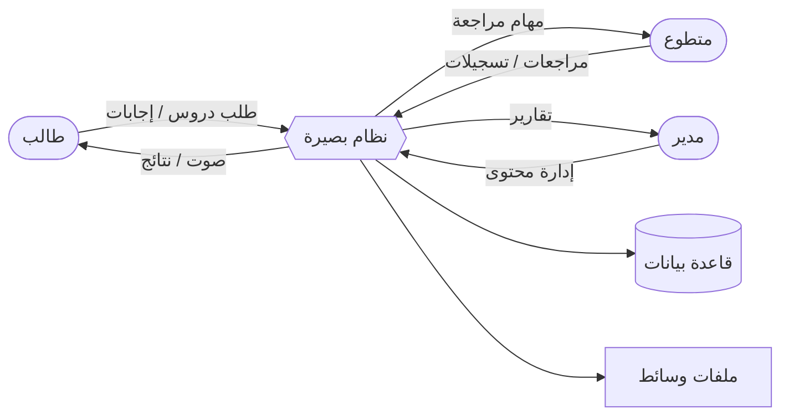


### 13.2 مخطط نشاط — التنقل الصوتي أثناء الدرس

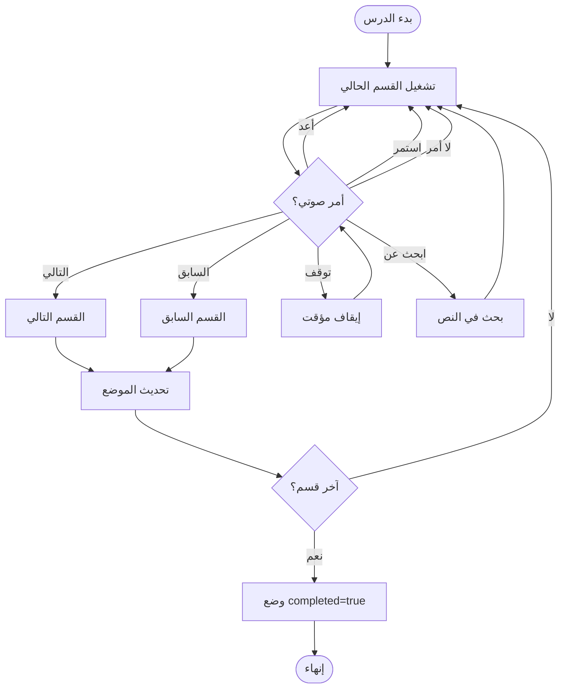


### 13.3 مخطط نشاط — تصحيح الإجابة

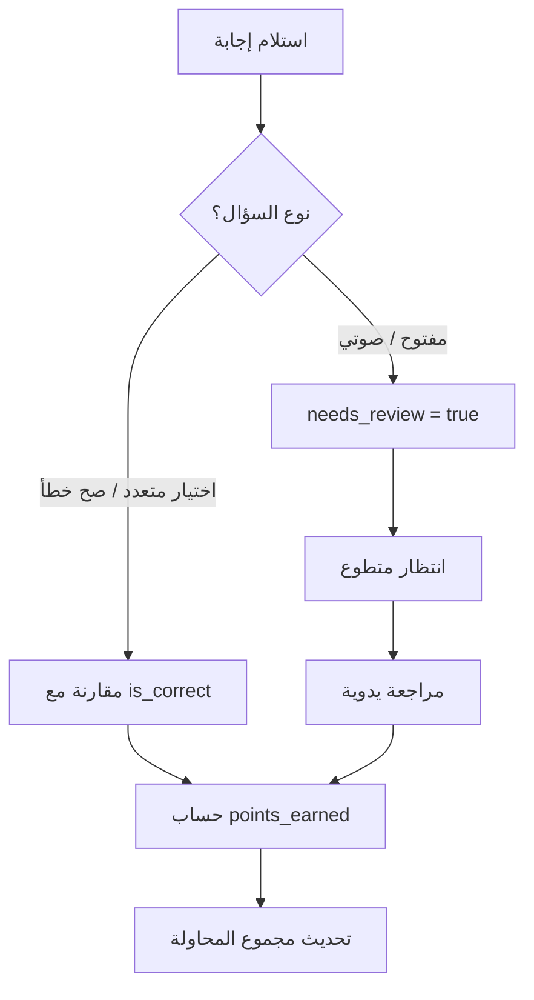


---


## 14. تصميم واجهات البرمجة (API)


### 14.1 هيكل عناوين API


| المجال                   | المسار الأساسي     |
| ------------------------ | ------------------ |
| المصادقة                 | `/api/auth/`       |
| الدروس والصفوف           | `/api/lessons/`    |
| الاختبارات (تطبيق tests) | `/api/tests/`      |
| المتطوعون                | `/api/volunteers/` |
| الإدارة                  | `/admin/`          |


### 14.2 نقاط النهاية الرئيسية


#### المصادقة (`core`)


| Method | Endpoint              | الوصف              |
| ------ | --------------------- | ------------------ |
| POST   | `/api/auth/register/` | تسجيل حساب         |
| POST   | `/api/auth/login/`    | تسجيل دخول → Token |
| GET    | `/api/auth/profile/`  | الملف الشخصي       |


#### الدروس (`lessons`)


| Method   | Endpoint                             | الوصف           |
| -------- | ------------------------------------ | --------------- |
| GET      | `/api/lessons/grades/`               | الصفوف          |
| GET      | `/api/lessons/categories/`           | المواد          |
| GET      | `/api/lessons/`                      | الدروس          |
| GET      | `/api/lessons/{id}/`                 | تفاصيل درس      |
| POST     | `/api/lessons/{id}/update_progress/` | تحديث التقدم    |
| GET      | `/api/lessons/{id}/get_progress/`    | قراءة التقدم    |
| GET      | `/api/lessons/search/?q=`            | بحث             |
| GET/POST | `/api/lessons/volunteer-roles/`      | أدوار المتطوعين |


#### الاختبارات (`tests`)


| Method | Endpoint                          | الوصف          |
| ------ | --------------------------------- | -------------- |
| GET    | `/api/tests/`                     | قائمة اختبارات |
| GET    | `/api/tests/{id}/`                | تفاصيل         |
| POST   | `/api/tests/{id}/start_attempt/`  | بدء محاولة     |
| POST   | `/api/tests/{id}/submit_answer/`  | إرسال إجابة    |
| POST   | `/api/tests/{id}/submit_attempt/` | إنهاء          |


#### المتطوعون (`volunteers`)


| Method   | Endpoint                          | الوصف           |
| -------- | --------------------------------- | --------------- |
| GET/POST | `/api/volunteers/transcriptions/` | مراجعات التفريغ |
| GET/POST | `/api/volunteers/recordings/`     | تسجيلات صوتية   |


### 14.3 نموذج الاستجابة (مثال درس)

```json
{
  "id": 1,
  "title": "مقدمة في الجبر",
  "category": 3,
  "audio_file": "/media/lessons/audio/lesson1.mp3",
  "transcribed_text": "...",
  "sections": [
    {
      "section_type": "heading",
      "text": "الفصل الأول",
      "order": 0,
      "audio_timestamp": 0.0
    }
  ],
  "status": "published",
  "conversion_status": "completed"
}
```

---


## 15. البنية البرمجية للمشروع


### 15.1 هيكل المجلدات

```
basera/
├── backend/                    # Django
│   ├── basera_backend/         # إعدادات المشروع
│   ├── core/                   # المستخدم والمصادقة
│   ├── lessons/                # صفوف، مواد، دروس، اختبارات موسعة
│   │   ├── models.py
│   │   ├── views.py
│   │   ├── tts_service.py
│   │   ├── transcription_service.py
│   │   └── text_conversion_service.py
│   ├── tests/                  # اختبارات مرتبطة بالدرس (نسخة مبسطة)
│   ├── volunteers/             # مراجعات وتسجيلات
│   └── requirements.txt
├── lib/                        # Flutter (واجهة المستخدم)
│   ├── config/app_config.dart
│   ├── models/
│   ├── services/
│   ├── screens/
│   └── widgets/
├── pubspec.yaml
└── README.md
```


### 15.2 تطبيقات Django والمسؤوليات


| التطبيق        | المسؤولية                                             |
| -------------- | ----------------------------------------------------- |
| **core**       | User مخصص، تسجيل، Token                               |
| **lessons**    | المحتوى التعليمي، الاختبارات الكاملة، VolunteerRole   |
| **tests**      | ViewSets للاختبارات (نموذج Quiz مبسط مرتبط بـ Lesson) |
| **volunteers** | TranscriptionReview، AudioRecording                   |


### 15.3 خدمات الخادم (Backend Services)


| الخدمة                | الملف                        | الوظيفة                 |
| --------------------- | ---------------------------- | ----------------------- |
| TextConversionService | `text_conversion_service.py` | استخراج نص من PDF       |
| TranscriptionService  | `transcription_service.py`   | تفريغ صوت (Whisper)     |
| TTSService            | `tts_service.py`             | تحويل نص إلى صوت (gTTS) |


### 15.4 طبقة Flutter (المخطط)


| الطبقة  | المكونات                                                                                                |
| ------- | ------------------------------------------------------------------------------------------------------- |
| العرض   | login_screen, home_screen, category_lessons_screen, lesson_detail_screen                                |
| الحالة  | Riverpod                                                                                                |
| الخدمات | api_service, auth_service, lesson_service, speech_service, voice_command_service, accessibility_service |
| التخزين | shared_preferences, hive                                                                                |


### 15.5 الأوامر الصوتية المدعومة


| الأمر      | الإجراء               |
| ---------- | --------------------- |
| التالي     | العنصر/القسم التالي   |
| السابق     | العنصر السابق         |
| أعد        | إعادة التشغيل/القراءة |
| توقف       | إيقاف مؤقت            |
| استمر      | متابعة                |
| الرئيسية   | العودة للرئيسية       |
| الخلف      | رجوع                  |
| ابحث عن... | بحث في المحتوى        |


---


## 16. التقنيات والأدوات


### 16.1 جدول التقنيات


| الطبقة       | التقنية                             | الإصدار / الملاحظة         |
| ------------ | ----------------------------------- | -------------------------- |
| Frontend     | Flutter                             | SDK ^3.7.2                 |
| إدارة الحالة | flutter_riverpod                    | ^2.5.1                     |
| STT          | speech_to_text                      | ^7.0.0                     |
| TTS          | flutter_tts                         | 3.8.3                      |
| صوت          | audioplayers, audio_service, record |                            |
| شبكة         | dio, http                           |                            |
| تخزين محلي   | hive, shared_preferences            |                            |
| Backend      | Django                              | 4.2.x                      |
| API          | Django REST Framework               | ≥3.14                      |
| CORS         | django-cors-headers                 |                            |
| قاعدة بيانات | SQLite (تطوير)                      | قابل للترقية لـ PostgreSQL |
| تفريغ        | OpenAI Whisper                      | اختياري                    |
| PDF          | PyPDF2, pdfplumber                  |                            |
| TTS خادم     | gTTS                                |                            |
| معالجة صوت   | pydub, ffmpeg-python                |                            |


### 16.2 مخطط التكامل التقني

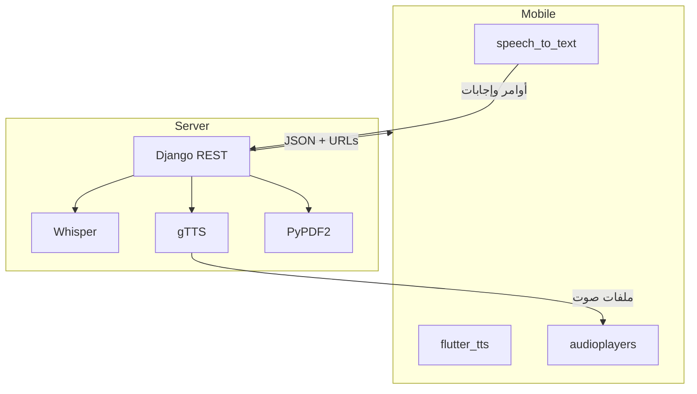


---


## 17. إمكانية الوصول والأمان


### 17.1 إمكانية الوصول (Accessibility)


| المبدأ          | التطبيق في بصيرة                                    |
| --------------- | --------------------------------------------------- |
| **إدراكي**      | الاعتماد على الصوت بدل الألوان والرسوم              |
| **تشغيلي**      | أزرار كبيرة (accessible_button)، قوائم قابلة للوصول |
| **قارئ الشاشة** | دعم TalkBack و VoiceOver عبر accessibility_service  |
| **تفاعل صوتي**  | voice_command_service للتنقل دون لمس                |


### 17.2 الأمان


| الجانب    | الآلية                                           |
| --------- | ------------------------------------------------ |
| المصادقة  | Token Authentication (DRF)                       |
| الصلاحيات | تمييز user_type و VolunteerRole                  |
| الملفات   | رفع ضمن MEDIA_ROOT مع صلاحيات Django             |
| الإنتاج   | SECRET_KEY من متغيرات البيئة، DEBUG=False، HTTPS |
| CORS      | django-cors-headers للتحكم بالنطاقات             |


### 17.3 الخصوصية

- بيانات التقدم مرتبطة بالمستخدم ولا تُشارك بين الطلاب.
- ملفات الإجابات الصوتية في مسارات معزولة (`quizzes/audio_answers/`).

---


## 18. خطة الاختبار


### 18.1 أنواع الاختبار


| النوع                   | الهدف                     | أمثلة                         |
| ----------------------- | ------------------------- | ----------------------------- |
| **وحدة (Unit)**         | نماذج Django، حساب الدرجة | QuizAttempt.score             |
| **تكامل (Integration)** | API endpoints             | start_attempt → submit_answer |
| **واجهة (UI)**          | Flutter widgets           | AccessibleButton              |
| **إمكانية وصول**        | TalkBack                  | التنقل في home_screen         |
| **صوت (Manual)**        | STT/TTS عربي              | أوامر "التالي"، قراءة درس     |
| **أداء**                | تحميل قائمة دروس          | < 2 ثانية                     |
| **قبول (UAT)**          | سيناريوهات طالب حقيقي     | استماع درس كامل + اختبار      |


### 18.2 مصفوفة تتبع المتطلبات ↔ الاختبارات


| المتطلب            | حالة الاختبار المقترحة               |
| ------------------ | ------------------------------------ |
| FR-03 تصفح هرمي    | GET grades → categories → lessons    |
| FR-06 تتبع تقدم    | POST update_progress ثم GET          |
| FR-09 تصحيح آلي    | إجابة خاطئة/صحيحة لـ multiple_choice |
| FR-10 مراجعة يدوية | Answer.needs_review بعد open_ended   |
| NFR-01 TalkBack    | فحص يدوي على جهاز Android            |


### 18.3 حالات اختبار نموذجية


| ID    | الخطوات             | النتيجة المتوقعة            |
| ----- | ------------------- | --------------------------- |
| TC-01 | تسجيل طالب جديد     | حساب user_type=student      |
| TC-02 | استماع درس 5 دقائق  | listening_time_seconds يزيد |
| TC-03 | تجاوز max_attempts  | رفض start_attempt           |
| TC-04 | متطوع يعتمد تفريغاً | status=approved للمراجعة    |


---


## 19. خطة التنفيذ والجدول الزمني


### 19.1 مراحل المشروع (مقترحة لمشروع تخرج)

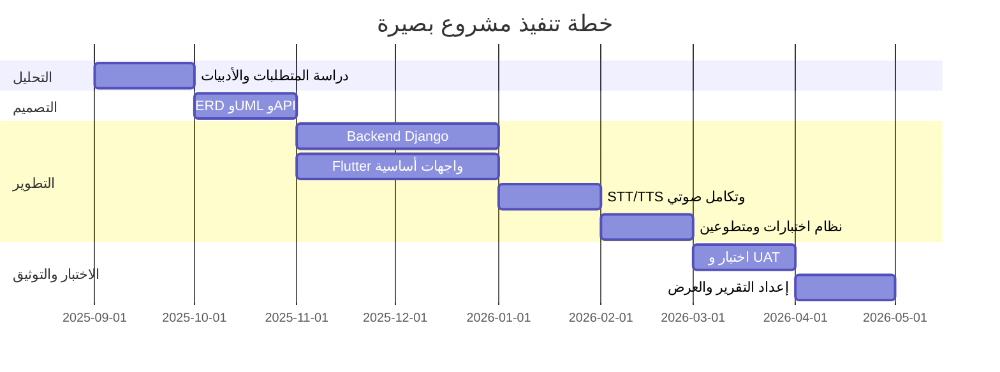


### 19.2 توزيع العمل (Roles)


| المرحلة      | Backend  | Frontend | توثيق        |
| ------------ | -------- | -------- | ------------ |
| تحليل وتصميم | مشاركة   | مشاركة   | كامل         |
| محتوى وAPI   | رئيسي    | تكامل    | API docs     |
| صوت وUX      | دعم      | رئيسي    | دليل مستخدم  |
| اختبار       | Unit/API | UI/A11y  | تقرير اختبار |


---


## 20. القيود والتحديات


| التحدي                           | التأثير                 | التخفيف                              |
| -------------------------------- | ----------------------- | ------------------------------------ |
| دقة STT للعربية                  | أخطاء في الأوامر        | قوائم أوامر محددة + تأكيد صوتي       |
| جودة TTS                         | تجربة استماع            | السماح بملفات صوتية بشرية            |
| حجم نماذج Whisper                | بطء على خادم ضعيف       | معالجة غير متزامنة + حالة conversion |
| ازدواجية Quiz في lessons و tests | تعقيد صيانة             | توحيد النماذج مستقبلاً (ملحق أ)      |
| بناء مكتبة محتوى                 | وقت طويل                | الاعتماد على المتطوعين               |
| Offline غير مكتمل                | استخدام بدون شبكة محدود | Hive + مزامنة لاحقة                  |


---


## 21. الأعمال المستقبلية

- [ ] تكامل Whisper محسّن للتفريغ العربي
- [ ] تلخيص ذكي بالذكاء الاصطناعي
- [ ] عمل كامل دون إنترنت (تنزيل الدروس)
- [ ] إحصائيات تقدم متقدمة ولوحة تحكم
- [ ] إشعارات (درس جديد، نتيجة اختبار)
- [ ] دعم لغات إضافية
- [ ] ترقية قاعدة البيانات إلى PostgreSQL للإنتاج
- [ ] توحيد نماذج الاختبارات بين تطبيقي `lessons` و `tests`

---


## 22. الخلاصة

مشروع **بصيرة** يقدم حلاً متكاملاً للتعليم الصوتي للمكفوفين عبر بنية **عميل-خادم** حديثة، ونموذج بيانات هرمي يعكس الواقع التعليمي (صف → مادة → درس)، ونظام تقييم صوتي مع دور فعّال للمتطوعين. التصميم يضع **إمكانية الوصول** في المركز وليس كملحق، ما يميزه عن التطبيقات التعليمية التقليدية.

من ناحية أكاديمية، يغطي المشروع دورة حياة هندسة البرمجيات: التحليل، التصميم (ERD/UML/DFD)، التنفيذ، الاختبار، والتطوير المستقبلي — وهو مؤهل للمناقشة كمشروع تخرج في هندسة البرمجيات أو تقانة المعلومات.

---


## 23. المراجع

1. World Wide Web Consortium (W3C). *Web Content Accessibility Guidelines (WCAG) 2.1.*
2. Django Software Foundation. *Django Documentation 4.2.* [https://docs.djangoproject.com/](https://docs.djangoproject.com/)
3. Django REST Framework. *API Guide.* [https://www.django-rest-framework.org/](https://www.django-rest-framework.org/)
4. Google Flutter Team. *Flutter Documentation.* [https://docs.flutter.dev/](https://docs.flutter.dev/)
5. OpenAI. *Whisper: Robust Speech Recognition.*
6. مخططات المشروع الداخلية: `README.md`, `PROJECT_DOCUMENTATION.md`, `PROJECT_STRUCTURE.md`
7. معايير تصميم تطبيقات إمكانية الوصول لنظامي Android (TalkBack) و iOS (VoiceOver) — وثائق المطورين الرسمية.

---


## 24. الملاحق


### الملحق أ — ملاحظة ازدواجية نموذج الاختبارات

يوجد في المشروع نموذجان للاختبارات:

1. `lessons/models.py`: نظام اختبارات موسع (Quiz مرتبط بـ Category و Lesson اختياري، أنواع أسئلة متعددة، VolunteerRole، إلخ) — **النموذج المرجعي لهذه الدراسة**.
2. `tests/models.py`: نموذج أبسط (Quiz مرتبط مباشرة بـ Lesson فقط) مع ViewSets في `/api/tests/`.

**توصية للمناقشة:** توضيح أن التطوير تدريجي وأن التوحيد خطوة refactor مخططة. هذا يظهر فهماً نقدياً للكود وليس عيباً إن عُولج كقرار تطويري.

### الملحق ب — حالات الدرس وحالات التحويل

**حالات الدرس (Lesson.status):** draft → review → approved → published

**حالات التحويل (conversion_status):** idle → extracting_text → text_extracted → converting_audio → completed / failed

### الملحق ج — أنواع المستخدمين والأدوار


| user_type | الوصف |
| --------- | ----- |
| student   | طالب  |
| volunteer | متطوع |
| admin     | مدير  |


| VolunteerRole.role | الوصف          |
| ------------------ | -------------- |
| reviewer           | مراجع محتوى    |
| transcriber        | مفروغ صوتي     |
| quiz_reviewer      | مراجع اختبارات |
| content_creator    | منشئ محتوى     |
| admin              | مدير متطوعين   |


### الملحق د — أسئلة شائعة في مناقشة التخرج

1. **لماذا Flutter وليس Native؟** كود واحد لـ Android و iOS، أداء جيد، دعم قوي للوصول.
2. **لماذا Django؟** سرعة تطوير، Admin جاهز، ORM، مجتمع واسع.
3. **كيف تضمن جودة التفريغ؟** مراجعة متطوع + TranscriptionReview + حقل reviewed.
4. **ماذا لو فشل التعرف الصوتي؟** أوامر محددة مسبقاً + بديل لمسي بأزرار كبيرة.
5. **كيف يُحسب النجاح في الاختبار؟** percentage ≥ passing_score → passed=True.
6. **الفرق عن قارئ الشاشة؟** تصميم صوتي أولاً وليس إضافة لطبقة بصرية.


### الملحق هـ — قائمة المخرجات للتسليم الأكاديمي


| #   | المخرج                                         |
| --- | ---------------------------------------------- |
| 1   | هذا الملف — دراسة مشروع التخرج                 |
| 2   | التطبيق القابل للتشغيل (APK / محاكي)           |
| 3   | الخادم الخلفي + قاعدة بيانات تجريبية           |
| 4   | عرض تقديمي (PowerPoint) مستخرج من الأقسام 1–12 |
| 5   | فيديو demo (3–5 دقائق) لسيناريو طالب ومتطوع    |
| 6   | دليل التثبيت `SETUP.md`                        |


---

*تم إعداد هذه الدراسة بناءً على تحليل الكود المصدري والوثائق الفعلية لمشروع بصيرة (Basera) — وثيقة حية يمكن تحديثها عند إضافة ميزات أو توحيد النماذج.*

**إصدار الوثيقة:** 1.0  
**تاريخ الإعداد:** مايو 2026