# كتاب تعريفي ودراسة أكاديمية لمشروع التخرج

## نظام بصيرة (Basera)
### منصة تعليمية صوتية للمكفوفين  
#### تحليل وتصميم وتنفيذ نظام معلومات تعليمي قائم على التفاعل الصوتي الكامل

> «التعليم حقّ للجميع؛ والوصول إليه يجب أن يكون ممكناً بالصوت كما هو ممكن بالبصر.»

---

## صفحة الغلاف الأكاديمية

| البند | يُملأ من الطالب |
| ----- | ---------------- |
| **الجامعة / الكلية / القسم** | …………………… |
| **عنوان المشروع** | بصيرة: منصة تعليمية صوتية للمكفوفين |
| **نوع العمل** | مشروع تخرج — نظام برمجي تطبيقي مع دراسة تحليل وتصميم |
| **اسم الطالب / الطلبة** | …………………… |
| **الرقم الجامعي** | …………………… |
| **اسم الدكتور المشرف** | …………………… |
| **العام الجامعي** | …………………… |
| **إصدار الوثيقة** | 3.1 — هوية بصرية موحّدة + تنسيق أكاديمي لملف Word |

هذه الوثيقة موجّهة أولاً إلى **الدكتور المشرف** كمرجع للتوجيه والمتابعة والمناقشة: المشكلة، المنهج، المتطلبات، التصميم، التنفيذ، والحدود.

---

### بطاقة المشروع

| البند | التفاصيل |
| ----- | -------- |
| **اسم المشروع** | بصيرة (Basera) |
| **طبيعة الوثيقة** | كتاب تعريفي + دراسة أكاديمية لمشروع التخرج |
| **نوع المشروع** | تطبيق جوال مع خادم خلفي (Client–Server) |
| **التقنيات** | Flutter (واجهة أمامية) + Django REST Framework (خادم خلفي) |
| **الفئة المستهدفة** | المكفوفون كلياً من عمر 14 سنة فما فوق |
| **المراحل التعليمية** | من الصف التاسع حتى التعليم الجامعي |
| **لغة الواجهة** | العربية (RTL) مع دعم قارئات الشاشة |
| **نمط التفاعل** | Audio-first — الصوت قناة الإنجاز الأساسية |

---

### إهداء

إلى كل طالبٍ لم يمنعه فقد البصر من طلب العلم، وإلى كل متطوعٍ يحوّل صوته ووقته إلى جسر معرفة، وإلى كل معلّمٍ يؤمن أن التقنية أداة إنصاف لا ترفاً، وإلى الدكتور المشرف الذي تُعرض عليه هذه الصفحات طلباً للتوجيه والتقويم.

---

### شكر وتقدير

يتقدّم معدّ هذه الدراسة بالشكر إلى الدكتور المشرف على ما سيقدّمه من ملاحظات منهجية وعلمية، وإلى كل من أسهم في بلورة مشروع بصيرة. كما يُشكر مجتمع البرمجيات المفتوحة الذي أتاح أدوات Flutter وDjango وWhisper وغيرها.

---

### كلمة إلى الدكتور المشرف

تجمع هذه الوثيقة ثلاثة مستويات يحتاجها المشرف عند المتابعة:

1. **المستوى المفاهيمي:** المشكلة، الفئة المستهدفة، التميز، والأثر.
2. **المستوى الهندسي:** المتطلبات، الكيانات، الواجهات، والقرارات المعمارية.
3. **المستوى التنفيذي والنقدي:** ما بُني في الكود، القيود، الازدواجيات، والمخاطر.

---

### كلمة افتتاحية

هذا الكتاب ليس مجرّد تقرير تقني يُسلَّم في نهاية فصل دراسي، بل محاولة لسرد مشروع **بصيرة** من الفكرة إلى المخططات، ومن المشكلة الإنسانية إلى القرارات الهندسية. نهدف أن يخرج القارئ — ولا سيما المشرف — بصورة كاملة: لماذا وُجد المشروع؟ لمن؟ كيف يُفكَّر؟ كيف يُصمَّم؟ وكيف يُبنى ويُختبر؟

بصيرة وُلدت من ملاحظة يومية في التعليم الرقمي: معظم ما يُسمّى «إتاحة» للمكفوفين هو إلحاق قارئ شاشة بتطبيق صُمم للمبصرين. أما الإنصاف الحقيقي فيبدأ عندما تُصاغ رحلة التعلّم حول **الصوت والتنظيم والمنهج**، لا حول إنقاذ واجهة بصرية بعد اكتمالها.

---

### الملخص (بالعربية)

يعالج مشروع **بصيرة** مشكلة ضعف الوصول التعليمي الرقمي المنظم للطلاب المكفوفين في السياق العربي. يقترح منصة صوتية أولاً (Audio-first) بـ Flutter وDjango REST: مكتبة هرمية (صف → مادة → درس)، استماع بشري أو TTS، أوامر صوتية، تتبع تقدّم، اختبارات، ومتطوعون لضمان الجودة. تعتمد الدراسة منهجاً في هندسة البرمجيات من التحليل إلى الاختبار.

**الكلمات المفتاحية:** إمكانية الوصول، التعليم الصوتي، المكفوفون، Flutter، Django، مشروع تخرج.

### Abstract (English)

**Basera** addresses limited structured digital learning for totally blind Arabic-speaking students. It proposes an audio-first platform (Flutter + Django REST): hierarchical content, human/TTS playback, voice navigation, progress tracking, quizzes, and volunteer quality control. The study follows software-engineering methodology from analysis to testing.

**Keywords:** accessibility, audio learning, blindness, Flutter, Django, graduation project.

---

### كيف تُقرأ هذه الوثيقة؟

1. **كتاب تعريفي (الأبواب 0–7، 11، 27–29):** للجلسة الأولى مع المشرف.
2. **دراسة تحليل وتصميم (8–18):** المتطلبات، ERD، UML، API.
3. **مرجع تنفيذي (19–26 والملاحق):** الكود، الاختبار، القيود.

المخططات بصيغة **Mermaid** في محررات Markdown وVS Code.

---

## فهرس المحتويات

### الباب الأول — الإطار المفاهيمي والتعريفي
0. الإطار البحثي للدراسة (المشكلة، الأسئلة، الأهمية، الحدود، المنهج)
1. الملخص التنفيذي الموسّع
2. المقدمة وخلفية المشروع
3. الرؤية والرسالة والقيم
4. فلسفة التصميم: الصوت أولاً
5. تحليل المشكلة والسياق
6. أهداف المشروع ومؤشرات النجاح
7. الإطار النظري والدراسات السابقة والأنظمة المشابهة
7ب. دراسة الجدوى

### الباب الثاني — التحليل والمتطلبات
8. تحليل المتطلبات
9. تحليل أصحاب المصلحة
10. حالات الاستخدام
11. رحلة المستخدم والسيناريوهات السردية
12. تحليل النظام ونموذج العمل

### الباب الثالث — التصميم والمخططات
13. تصميم النظام والبنية المعمارية
14. مخطط الكيانات والعلاقات (ERD)
15. مخططات UML
16. مخططات التدفق والنشاط والسياق
17. تصميم واجهات البرمجة (API)
18. خريطة الشاشات وتجربة الاستخدام

### الباب الرابع — التنفيذ والجودة
19. البنية البرمجية للمشروع
20. التحكم الصوتي المزدوج في الدرس
21. التقنيات والأدوات ومبررات الاختيار
22. إمكانية الوصول والأمان والخصوصية والأخلاقيات
23. خطة الاختبار
24. خطة التنفيذ والجدول الزمني
25. منهجية التطوير وإدارة المشروع

### الباب الخامس — الأفق والأثر
26. القيود والتحديات وإدارة المخاطر
27. الأثر التعليمي والاجتماعي المتوقع
28. الأعمال المستقبلية
29. الخلاصة والتوصيات للمشرف
30. قاموس المصطلحات
31. المراجع
32. الملاحق

---

## 0. الإطار البحثي للدراسة

### 0.1 صياغة المشكلة البحثية

في ظل التوسع في التعليم الإلكتروني، يواجه الطالب المكفوف **فجوة وصول** إلى محتوى عربي منظم مصمم للتفاعل الصوتي. **المشكلة المركزية:** كيف يُبنى نظام تعليمي صوتي يجمع المنهج، والتقييم، وجودة المحتوى عبر متطوعين؟

### 0.2 الأسئلة البحثية

| # | السؤال |
| - | ------ |
| Q1 | ما المتطلبات الوظيفية وغير الوظيفية للمنصة؟ |
| Q2 | ما البنية ونموذج البيانات للمحتوى والاختبارات؟ |
| Q3 | كيف يُدمَج الصوت البشري مع TTS والأوامر الصوتية؟ |
| Q4 | كيف يُوازَن التصحيح الآلي والمراجعة البشرية؟ |
| Q5 | ما القيود (STT، Offline) وكيف تُدار؟ |

### 0.3 أهمية وحدود الدراسة

**الأهمية:** نظرية (إمكانية الوصول)، تطبيقية (نموذج أولي)، أكاديمية (وثيقة متكاملة). **الحدود:** مكفوفون كلياً 14+؛ محتوى نموذجي لا منهاج كامل؛ Offline جزئي؛ ازدواجية Quiz (ملحق أ).

### 0.4 منهجية العمل

تحليل → متطلبات → ERD/UML → تصميم معماري → تنفيذ تكراري → اختبار → توثيق.

---

## 1. الملخص التنفيذي

**بصيرة** منصة تعليمية رقمية وُلدت من سؤال بسيط وعميق: كيف نجعل الطالب المكفوف يتعلّم ذاتياً عبر هاتفه، بصوت واضح، وتنقّل سلس، وتقييم عادل، دون أن يضطر إلى «ترجمة» واجهة بصرية صُممت أصلاً للمبصرين؟

### 1.1 جوهر الحل

| المكوّن | الدور |
| ------- | ----- |
| **Flutter** | STT/TTS، ملفات بشرية، أوامر صوتية، TalkBack/VoiceOver |
| **Django REST** | محتوى هرمي، تقدّم، اختبارات، متطوعون، PDF→صوت |
| **المتطوعون** | مراجعة تفريغ، تصحيح مفتوح، رفع تسجيلات |

### 1.2 ما يقدمه الكتاب للمشرف

- تبرير المشروع والبدائل والتميز التنافسي.
- قرارات التصميم (Client–Server، هرم المحتوى، مساران للصوت).
- ارتباط التحليل بالكود الفعلي في المشروع.
- شفافية في القيود: STT العربي، شح المحتوى، ازدواجية Quiz.

يجيب المشروع ببناء نظام متكامل يعتمد **التفاعل الصوتي الكامل (Audio-first)**، يجمع بين:

- **تطبيق جوال** بـ Flutter: تحويل صوت↔نص (STT/TTS)، تشغيل ملفات صوتية بشرية، أوامر صوتية، ودعم TalkBack/VoiceOver.
- **خادم خلفي** بـ Django REST Framework: محتوى هرمي (صف → مادة → درس)، تقدّم الطالب، اختبارات، متطوعون، وتحويل PDF/نص إلى تجربة استماع.

الفجوة ليست تقنية فقط بل **تصميمية وإنسانية**: غياب منصات عربية شاملة مصممة من الأساس للمكفوفين. بصيرة تضع نفسها عند تقاطع التخصص والشمول والمنهج والمجتمع.

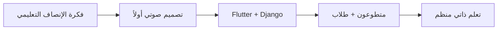
```mermaid
flowchart LR
    Idea[فكرة الإنصاف التعليمي] --> Design[تصميم صوتي أولاً]
    Design --> Build[Flutter + Django]
    Build --> Community[متطوعون + طلاب]
    Community --> Impact[تعلم ذاتي منظم]
```

من منظور هندسة البرمجيات تغطي الوثيقة دورة الحياة: التحليل، التصميم، التنفيذ، الاختبار، والأفق المستقبلي — **للتقديم للمشرف** وللمناقشة النهائية.

---

## 2. المقدمة وخلفية المشروع

### 2.1 خلفية الموضوع

شهد التعليم الرقمي — ولا سيما بعد تسارع التحول الرقمي في المؤسسات التعليمية — توسعاً هائلاً في المنصات والتطبيقات والمحتوى المرئي. غير أن هذا التوسع بُني في أغلبه على **فرضية الإبصار**: أن المتعلم يرى الشاشة، يقرأ النص، يتابع الفيديو، ويختار العنصر باللمس البصري. وعندما يُطلب «إتاحة» هذا المحتوى للمكفوفين، تُضاف غالباً طبقة **قارئ الشاشة** (TalkBack على Android، VoiceOver على iOS) فوق واجهة لم تُكتب له.

هذا النموذج — الذي يُسمى أحياناً **Retrofit Accessibility** — ينجح أحياناً في الوصول إلى المعلومة، لكنه يفشل غالباً في بناء **تجربة تعليمية متكاملة**. السبب ليس تقنياً وحسب، بل **معمارياً وتربوياً**: المستخدم المكفوف يُجبر على استكشاف هيكل بصري (قوائم، أيقونات، ألوان، تخطيطات) عبر وصف صوتي متتابع، ما يزيد زمن إنجاز المهمة ويُشتت الانتباه عن المحتوى التعليمي ذاته.

من هنا تنبع **الحاجة إلى تصميم أصيل (Native Design)** للتعليم الصوتي: محتوى مسموع أو قابل للقراءة الآلية بجودة، أوامر منطوقة للتنقل، تقييم يقبل الإجابة الصوتية، ومسارات تعليمية تعكس المنطق المدرسي (صف، مادة، درس) لا منطق «صفحة ويب».

### 2.2 السياق العربي

في السياق العربي تتضاعف التحديات:

1. **شح المحتوى التعليمي الصوتي المنظم** المطابق للمناهج الرسمية.
2. **جودة متفاوتة** لمحركات TTS وSTT للغة العربية (لهجات، تشكيل، مصطلحات علمية).
3. **اعتماد الطالب** على قنوات غير رسمية (رسائل صوتية، مجموعات، تسجيلات فردية) بلا فهرسة ولا تقييم.
4. **غياب منصة** تجمع: منهج + اختبار + تتبع تقدم + مجتمع متطوعين في منتج واحد.

مشروع **بصيرة** يُقدَّم في هذا السياق كإجابة **هندسية–تربوية** قابلة للنقاش الأكاديمي، لا كمنتج تجاري جاهز للإطلاق الواسع فوراً.

### 2.3 ما الذي يحتاجه المتعلم المكفوف؟

| المحور | المعنى التربوي | المعنى العملي في بصيرة |
| ------ | -------------- | ---------------------- |
| **المحتوى** | مواد مطابقة للمرحلة الدراسية | Grade → Category → Lesson → LessonSection |
| **الاستماع** | صوت واضح بإيقاع مناسب | ملف بشري + TTS + تحكم إيقاف/متابعة |
| **التنقّل** | استقلالية دون مرافق | أوامر: التالي، السابق، توقف، استمر، بحث |
| **التقييم** | معرفة مستوى الفهم | Quiz، تصحيح آلي، مراجعة للمفتوح |
| **التتبع** | إحساس بالتقدم | LessonProgress: موضع، وقت استماع، إكمال |
| **المجتمع** | جودة واستدامة | TranscriptionReview، AudioRecording، VolunteerRole |

### 2.4 فكرة المشروع وتسمية «بصيرة»

**بصيرة** — من البصيرة بمعنى الفهم والإدراك — اسم يرمز إلى أن **فقدان البصر لا يلغي القدرة على الفهم العميق**. الرسالة الرمزية تدعم الرسالة التقنية: المنصة ليست «قارئ شاشة للمدرسة» بل **فضاء تعلّم صوتي**.

عملياً تجمع المنصة ستة محاور مترابطة:

1. **مكتبة هرمية** للمحتوى التعليمي.
2. **تحويل المحتوى** (PDF، نص، صوت) إلى تجربة استماع.
3. **تفاعل صوتي** للتنقل والبحث.
4. **اختبارات** متعددة الأنواع.
5. **نظام متطوعين** للجودة.
6. **تتبع تقدّم** الطالب.

### 2.5 نطاق المشروع

| ضمن النطاق | خارج النطاق (حالياً) | ملاحظة للمشرف |
| ---------- | --------------------- | -------------- |
| تطبيق Android/iOS/Web عبر Flutter | تطبيق سطح مكتب منفصل | Flutter يغطي الجوال والويب |
| API REST للمحتوى والمصادقة | نظام دفع أو اشتراكات | نموذج مجتمعي/تعليمي |
| إدارة صفوف ومواد ودروس | منصة مؤتمرات حية | يمكن إضافتها لاحقاً |
| اختبارات صوتية ونصية | تلخيص AI متقدم | حقل summary موجود |
| أدوار المتطوعين | منهاج وطني كامل | يحتاج شراكات |

### 2.6 أسئلة المشروع — وكيف تجيب عنها الدراسة

| السؤال | إجابة مختصرة في هذه الوثيقة |
| ------ | ---------------------------- |
| كيف نصمّم تطبيقاً عربياً صوتياً؟ | Audio-first + أوامر محددة + TalkBack (باب 4، 18، 20) |
| ما البنية للصف→مادة→درس؟ | ERD و `lessons/models.py` (باب 14) |
| كيف ندمج بشري + TTS؟ | مساران متوازيان بلا تشغيل متزامن (باب 20) |
| كيف نضمن الجودة؟ | VolunteerRole + TranscriptionReview (باب 12) |
| حدود STT وOffline؟ | قيود + Hive مخطط (باب 26) |

---

## 3. الرؤية والرسالة والقيم

### 3.1 الرؤية

أن تصبح بصيرة جسراً رقمياً يمكّن الطلاب المكفوفين في الثانوية والجامعة من التعلّم الذاتي المنظم، بالصوت والكرامة والاستقلالية.

### 3.2 الرسالة

توفير منصة تعليمية صوتية عربية قابلة للتوسع، تربط محتوىً منظماً بتفاعل صوتي كامل ومجتمع متطوعين يضمن الجودة.

### 3.3 القيم

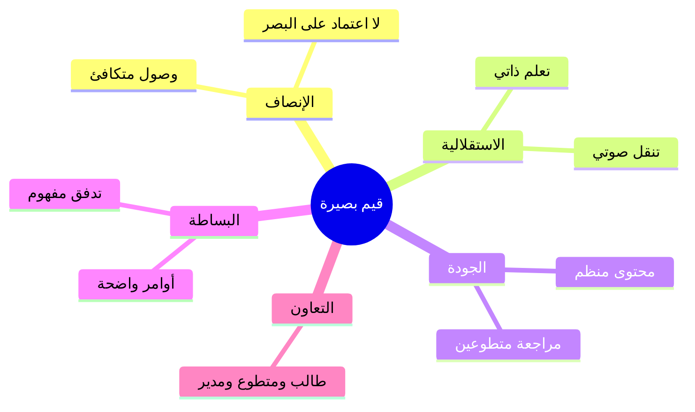
```mermaid
mindmap
  root((قيم بصيرة))
    الإنصاف
      وصول متكافئ
      لا اعتماد على البصر
    الاستقلالية
      تعلم ذاتي
      تنقل صوتي
    الجودة
      مراجعة متطوعين
      محتوى منظم
    البساطة
      أوامر واضحة
      تدفق مفهوم
    التعاون
      طالب ومتطوع ومدير
```

| القيمة | انعكاسها في المنتج |
| ------ | ------------------- |
| الإنصاف | مسارات مصممة للمكفوف لا «مكيّفة» لاحقاً |
| الاستقلالية | درس واختبار دون مرافق دائم |
| الجودة | حالات درس ومراجعة تفريغ |
| البساطة | أوامر محددة بدل حوار حر معقّد |
| التعاون | أدوار متطوعين مرتبطة بالمواد |

---

## 4. فلسفة التصميم: الصوت أولاً

### 4.1 ماذا تعني Audio-first؟

**Audio-first** ليست مجرد «إضافة TTS»، بل **إعادة ترتيب أولويات التصميم**: الصوت هو القناة **الأساسية** لإنجاز المهام، واللمس/البصر **مساران مساعدان**. في بصيرة، كل مهمة جوهرية — اختيار الصف، فتح الدرس، التشغيل، الإيقاف المؤقت، المتابعة، حل الاختبار، سماع النتيجة — **يجب** أن تكون قابلة للإنجاز صوتياً أو عبر قارئ شاشة بمسار منطقي قصير.

هذا يختلف جذرياً عن **Visual-first + Screen Reader**:

| Visual-first + SR | Audio-first (بصيرة) |
| ----------------- | ------------------- |
| الشاشة مصدر الحقيقة | الصوت/النص المنطوق مصدر الحقيقة |
| التنقل = استكشاف عناصر UI | التنقل = أوامر ومسارات تعليمية |
| الفيديو/الصورة محور | الصوت/النص المفروغ محور |
| الإتاحة «ملحق» | الإتاحة «أصل التصميم» |

### 4.2 طبقات التفاعل الصوتي

يُفهم النظام على أربع طبقات متراكمة؛ كل طبقة تبني على التي قبلها:

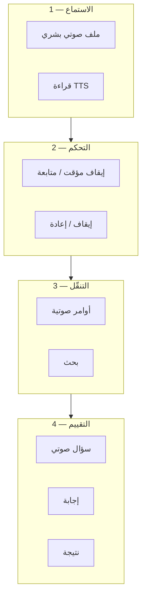
```mermaid
flowchart TB
    subgraph L1["1 — الاستماع"]
        A1[ملف صوتي بشري]
        A2[قراءة TTS]
    end
    subgraph L2["2 — التحكم"]
        B1[إيقاف مؤقت / متابعة]
        B2[إيقاف / إعادة]
    end
    subgraph L3["3 — التنقّل"]
        C1[أوامر صوتية]
        C2[بحث]
    end
    subgraph L4["4 — التقييم"]
        D1[سؤال صوتي]
        D2[إجابة]
        D3[نتيجة]
    end
    L1 --> L2 --> L3 --> L4
```

### 4.3 مبدأ المسارين المتوازيين

في شاشة الدرس يتعايش مساران **لكن لا يعملان معاً**:

1. **المسار البشري:** ملف `audio_file` عبر `audioplayers` — أغلى جودة وتعبير، مفضل للدروس المسجلة من متطوع.
2. **المسار الآلي:** `transcribed_text` أو `text_content` عبر `flutter_tts` — يغطي غياب الملف، المراجعة السريعة، أو محتوى مستخرج من PDF.

**القاعدة الذهبية:** بدء أحد المسارين **يوقف** الآخر فوراً. السبب معرفي (تجنب تداخل مصدرين) وعملي (تجنب تضارب STT/TTS مع الميكروفون). هذا قرار **UX** مبرر أمام المشرف، لا تفصيلاً ثانوياً.

### 4.4 مبادئ تصميم إضافية

| المبدأ | التطبيق |
| ------ | -------- |
| **البساطة الصوتية** | أوامر قصيرة محددة («التالي») لا حوار حر معقد |
| **التغذية الراجعة** | إعلان صوتي عند بدء/إيقاف/اكتمال |
| **المرونة** | أزرار لمس كبيرة عند فشل STT |
| **الاتساق** | نفس الأوامر في الدرس والاختبار حيث أمكن |
| **التدرج** | صف → مادة → درس — لا قفز عشوائي |

---

## 5. تحليل المشكلة والسياق

### 5.1 وصف المشكلة — بأبعادها

يمكن تشريح مشكلة الطالب المكفوف في التعليم الرقمي على **أربعة أبعاد**:

- **المعرفي:** صعوبة الوصول لمواد منظمة قابلة للبحث ومقسمة (عناوين، فقرات).
- **الزمني:** بطء التعلم مع التطبيقات العامة وقارئ الشاشة.
- **التقييمي:** غياب اختبارات ذاتية صوتية.
- **التنظيمي:** اعتماد على مساعدين وتسجيلات غير مفهرسة.

بصيرة **تنظّم** الدعم البشري لا تلغيه.

### 5.2 تحليل SWOT

| القوة (S) | الضعف (W) |
| --------- | --------- |
| تصميم صوتي أولاً | اعتماد على جودة STT/TTS للعربية |
| قابل للتوسع | حاجة لمتطوعين |
| بنية هرمية واضحة | Offline غير مكتمل |
| دعم Accessibility | ازدواجية نماذج اختبار (ملحق أ) |

| الفرص (O) | التهديدات (T) |
| --------- | -------------- |
| شراكات جمعيات المكفوفين | منافسة عالمية |
| Whisper و AI | تكلفة استضافة الصوت |
| مناهج رسمية | سياسات المتاجر |
| مؤسسات محلية | شح المحتوى عند الإطلاق |

### 5.3 لماذا الحل المقترح مناسب؟ — حجة للمشرف

الحل **ليس** «تطبيقاً واحداً يحل كل شيء»، بل **إطاراً** يجمع:

1. **تخصصاً في الفئة** (مكفوفون، عربي، مرحلة ثانوية–جامعية).
2. **تقنية حديثة** قابلة للصيانة (Flutter + Django).
3. **نموذجاً مجتمعياً** للاستدامة (متطوعون).
4. **فصلاً** بين إنتاج المحتوى (Backend + Admin + Volunteers) واستهلاكه (Flutter).

هذا الربط يجعل المشروع **قابلاً للتوسع** دون إعادة بناء من الصفر عند إضافة محتوى أو شركاء.

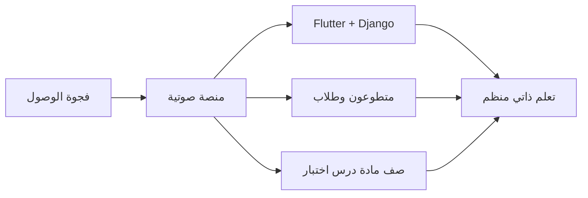
```mermaid
flowchart LR
    Problem[فجوة الوصول] --> Approach[منصة صوتية]
    Approach --> Tech[Flutter + Django]
    Approach --> People[متطوعون وطلاب]
    Approach --> Pedagogy[صف مادة درس اختبار]
    Tech & People & Pedagogy --> Outcome[تعلم ذاتي منظم]
```

---

## 6. أهداف المشروع ومؤشرات النجاح

### 6.1 الهدف العام

منصة تعليمية صوتية متكاملة للتعلّم الذاتي المنظم عبر الهاتف، مع محتوى هرمي وتفاعل صوتي وتقييم ومجتمع مراجعة.

### 6.2 الأهداف التفصيلية

| # | الهدف | مؤشر النجاح |
| - | ----- | ----------- |
| 1 | مكتبة هرمية صف→مادة→درس | تصفح صوتي للتصنيفات |
| 2 | استماع وتنقل صوتي | أوامر التالي/السابق/أعد/توقف/استمر |
| 3 | تتبع التقدم | حفظ الموضع ووقت الاستماع |
| 4 | اختبارات صوتية | تصحيح آلي + مراجعة للمفتوحة |
| 5 | إشراك المتطوعين | تفريغ وتسجيلات وأدوار |
| 6 | تحويل PDF/نص | conversion_status وتقدم |
| 7 | إمكانية وصول عالية | TalkBack/VoiceOver وأزرار كبيرة |
| 8 | تحكم تشغيل موثوق | إيقاف ومتابعة من نفس الموضع |

### 6.3 أهداف أكاديمية

تحليل مشكلة حقيقية، تصميم ERD/UML متسق مع التنفيذ، نموذج أولي عامل يغطي مسارات الطالب والمتطوع، وتوثيق القيود بشفافية.

---

## 7. الإطار النظري والدراسات السابقة والأنظمة المشابهة

### 7.1 الإطار النظري

تستند بصيرة إلى تقاطع ثلاثة حقول:

**1. إمكانية الوصول (Web/App Accessibility):**  
معايير WCAG 2.1 تفرّق بين **Perceivable, Operable, Understandable, Robust**. بصيرة تركز على **Operable** و**Perceivable** عبر الصوت: ما لا يُرى يُسمع ويُقال.

**2. التصميم الشامل (Universal Design for Learning — UDL):**  
UDL يقترح قنوات متعددة للتمثيل والتفاعل والتعبير. بصيرة تقدّم: تمثيلاً صوتياً، تفاعلاً صوتياً، وتعبيراً صوتياً في الاختبارات.

**3. هندسة البرمجيات:**  
Client–Server، REST API، نمذجة بيانات علاقية، فصل الاهتمامات (core / lessons / tests / volunteers).

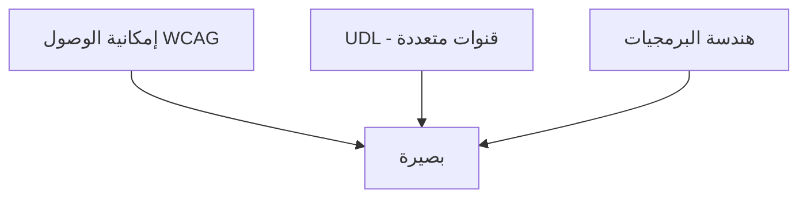
```mermaid
flowchart TB
    A11y[إمكانية الوصول WCAG]
    UDL[UDL - قنوات متعددة]
    SE[هندسة البرمجيات]
    A11y --> Basera[بصيرة]
    UDL --> Basera
    SE --> Basera
```

### 7.2 الدراسات والتجارب السابقة — مقارنة نوعية

| المصدر / الفئة | ما يقدمه | ما ينقصه بالنسبة لبصيرة |
| -------------- | -------- | ------------------------- |
| قارئ شاشة + LMS | وصول لمحتوى موجود | غير مصمم صوتياً؛ بطء؛ لا اختبارات صوتية متكاملة |
| كتب صوتية (Audible…) | جودة استماع | لا منهج مدرسي؛ لا اختبار؛ لا تتبع |
| تطبيقات قرآن/تجويد | نجاح في مجال ضيق | لا يغطي مواد ثانوية/جامعية |
| منصات MOOC | محتوى غني | تعتمد الفيديو؛ ضعيف للمكفوف |
| **بصيرة** | هرم منهجي + صوت + اختبار + متطوعون | يحتاج بناء محتوى عند الإطلاق |

### 7.3 دراسة الأنظمة المشابهة — جدول تفصيلي

| النظام | القوة | الضعف مقابل بصيرة |
| ------ | ----- | ------------------ |
| قارئ شاشة + مواقع | محتوى واسع | غير مصمم صوتياً |
| كتب صوتية | جودة صوت | بلا اختبارات منهجية |
| تعليم عن بعد عام | مناهج | يعتمد البصر |
| تطبيقات تجويد | تخصص صوتي | مجال ضيق |
| **بصيرة** | شمولية + تخصص | يحتاج بناء محتوى |

**التميز التنافسي لبصيرة — للمناقشة:**  
(1) Audio-first أصيل لا retrofitted.  
(2) هيكل صف/مادة/درس يعكس الواقع التعليمي العربي.  
(3) اختبارات صوتية مع تصحيح هجين.  
(4) دور المتطوعين مدمج في نموذج البيانات لا كفكرة جانبية.  
(5) مساران للصوت (بشري + TTS) بقواعد واضحة.

---

## 7ب. دراسة الجدوى

### 7ب.1 الجدوى التقنية

| المعيار | التقييم | التبرير |
| ------- | ------- | ------- |
| توفر التقنيات | **عالٍ** | Flutter، Django، STT/TTS متوفرة ومفتوحة |
| تعقيد التكامل | **متوسط** | REST واضح؛ الصوت يحتاج اختباراً يدوياً |
| قابلية التوسع | **عالٍ** | فصل Client/Server؛ PostgreSQL لاحقاً |
| STT العربي | **متوسط–منخفض** | يُخفّف بأوامر محددة وأزرار |

**الخلاصة:** الجدوى التقنية **مؤكدة** لنموذج تخرج؛ التحدي في **جودة الصوت** لا في البنية.

### 7ب.2 الجدوى الاقتصادية

- **تكلفة تطوير:** منخفضة نسبياً (أدوات مفتوحة، فريق طلاب).
- **تكلفة تشغيل:** استضافة + تخزين ملفات صوتية — تتزايد مع المحتوى.
- **نموذج إيراد:** خارج نطاق المشروع الحالي (تعليمي/مجتمعي).

### 7ب.3 الجدوى التشغيلية

- **يتطلب:** متطوعين لمراجعة التفريغ؛ مدير محتوى (Admin).
- **بدون متطوعين:** TTS وWhisper يعملان لكن **الجودة التربوية** تتراجع.

### 7ب.4 الجدوى الزمنية

جدول Gantt في الباب 24 (8 أشهر تقريباً) **واقعي** لفريق 2–3 طلاب مع مشرف.

### 7ب.5 توصية الجدوى للمشرف

**المشروع مجدٍ أكاديمياً وتقنياً** كمشروع تخرج، بشرط:  
(1) تحديد نطاق محتوى تجريبي (صف واحد، 2–3 مواد).  
(2) اختبار UAT مع مستخدم واحد على الأقل من الفئة المستهدفة إن أمكن.  
(3) توثيق القيود بصراحة في المناقشة.

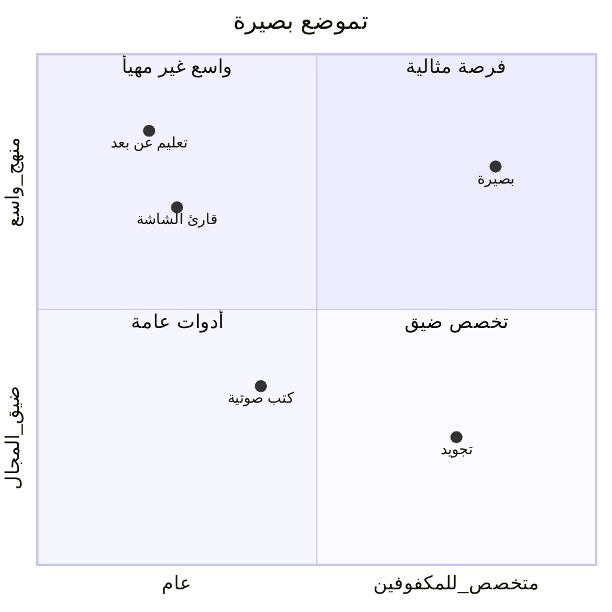
```mermaid
quadrantChart
    title تموضع بصيرة
    x-axis عام --> متخصص_للمكفوفين
    y-axis ضيق_المجال --> منهج_واسع
    quadrant-1 فرصة مثالية
    quadrant-2 واسع غير مهيأ
    quadrant-3 أدوات عامة
    quadrant-4 تخصص ضيق
    قارئ الشاشة: [0.25, 0.70]
    كتب صوتية: [0.40, 0.35]
    تعليم عن بعد: [0.20, 0.85]
    تجويد: [0.75, 0.25]
    بصيرة: [0.82, 0.78]
```

---

## 8. تحليل المتطلبات

يترجم هذا الباب الحاجة الإنسانية إلى متطلبات **قابلة للقياس والاختبار والمناقشة** أمام المشرف. اعتُمدت صيغة: **رمز + وصف + أولوية + معيار قبول مختصر**.

### 8.0 منهجية جمع المتطلبات

1. **تحليل المشكلة** والسيناريوهات (أبواب 5، 11).
2. **مراجعة الكود** (`models.py`, `views.py`, Flutter services).
3. **معايير إمكانية الوصول** WCAG وTalkBack.
4. **أولوية MoSCoW** ضمنياً: Must (عالية)، Should (متوسطة)، Could (منخفضة).

### 8.1 المتطلبات الوظيفية — جدول ملخّص


| الرمز | المتطلب                                | الأولوية |
| ----- | -------------------------------------- | -------- |
| FR-01 | تسجيل مستخدم جديد (طالب / متطوع)       | عالية    |
| FR-02 | تسجيل الدخول والحصول على ملف شخصي      | عالية    |
| FR-03 | عرض الصفوف الدراسية والمواد والدروس    | عالية    |
| FR-04 | تشغيل الدرس صوتياً (ملف أو TTS)        | عالية    |
| FR-05 | التنقل بين أقسام الدرس صوتياً          | عالية    |
| FR-06 | حفظ موضع الاستماع ووقت الاستماع        | عالية    |
| FR-07 | البحث في المحتوى (نصي/صوتي)            | متوسطة   |
| FR-08 | بدء محاولة اختبار وإرسال إجابات        | عالية    |
| FR-09 | تصحيح تلقائي لأسئلة الاختيار وصح/خطأ   | عالية    |
| FR-10 | مراجعة متطوع للإجابات المفتوحة/الصوتية | عالية    |
| FR-11 | رفع ومراجعة تفريغ الدروس               | عالية    |
| FR-12 | رفع تسجيل صوتي من متطوع                | متوسطة   |
| FR-13 | استخراج نص من PDF وتحويله لصوت         | متوسطة   |
| FR-14 | تلخيص درس (حقل summary)                | منخفضة   |
| FR-15 | إدارة أدوار المتطوعين حسب المادة       | متوسطة   |

### 8.1ب شرح تفصيلي لمجموعات المتطلبات

**المصادقة والهوية (FR-01, FR-02):**  
نموذج `User` في `core` يميّز `student`, `volunteer`, `admin`. المصادقة عبر Token (DRF). **معيار القبول:** تسجيل دخول ناجح → Token → الوصول لـ profile.

**المحتوى والاستماع (FR-03 – FR-07):**  
هرم Grade → Category → Lesson → LessonSection. تشغيل `audio_file` أو TTS. `LessonProgress` يحفظ `current_position` و`listening_time_seconds`. **معيار القبول:** طالب يستأنف من موضع الإيقاف.

**الاختبارات (FR-08 – FR-10):**  
Quiz → Question → QuizAttempt → Answer. تصحيح آلي لـ multiple_choice و true_false؛ `needs_review` للمفتوح والصوتي. **معيار القبول:** passed=true عند percentage ≥ passing_score.

**المتطوعون والتحويل (FR-11 – FR-15):**  
TranscriptionReview، AudioRecording، VolunteerRole. `conversion_status` لتتبع PDF→نص→صوت. **معيار القبول:** درس ينتقل draft → published بعد مراجعة.

### 8.2 المتطلبات غير الوظيفية (Non-Functional Requirements)


| الرمز  | المتطلب             | المعيار المقترح                                                |
| ------ | ------------------- | -------------------------------------------------------------- |
| NFR-01 | **إمكانية الوصول**  | WCAG 2.1 مستوى AA حيث ينطبق                                    |
| NFR-02 | **الأداء**          | استجابة API < 2 ثانية للقوائم                                  |
| NFR-03 | **الأمان**          | Token authentication؛ HTTPS في الإنتاج                         |
| NFR-04 | **قابلية التوسع**   | فصل Frontend/Backend؛ قاعدة بيانات قابلة للترقية لـ PostgreSQL |
| NFR-05 | **الموثوقية**       | تتبع حالة فشل التحويل (conversion_error)                       |
| NFR-06 | **قابلية الصيانة**  | تطبيقات Django منفصلة (core, lessons, tests, volunteers)       |
| NFR-07 | **دعم العربية**     | واجهات ونماذج بأسماء عربية (verbose_name)                      |
| NFR-08 | **العمل دون اتصال** | تخزين محلي (Hive) — مخطط توسعه                                 |

### 8.3 مصفوفة تتبع المتطلبات → المكونات

| المتطلب | Backend | Flutter | جدول/خدمة |
| ------- | ------- | ------- | ---------- |
| FR-03 | GradeViewSet, CategoryViewSet | home_screen | Grade, Category |
| FR-04 | Lesson audio/TTS URLs | lesson_detail, speech_service | Lesson |
| FR-06 | update_progress | lesson_service | LessonProgress |
| FR-08 | QuizViewSet | quiz screens | Quiz, QuizAttempt |
| FR-11 | TranscriptionReviewViewSet | volunteer UI | TranscriptionReview |
| NFR-01 | — | accessibility_service | Semantics |

---

## 9. تحليل أصحاب المصلحة

فهم **من يتأثر بالنظام ومن يؤثر فيه** شرط لنجاح التصميم. في بصيرة توجد علاقة **ثلاثية**: طالب يستهلك، متطوع ينتج ويراجع، مدير ينشر ويحكم.

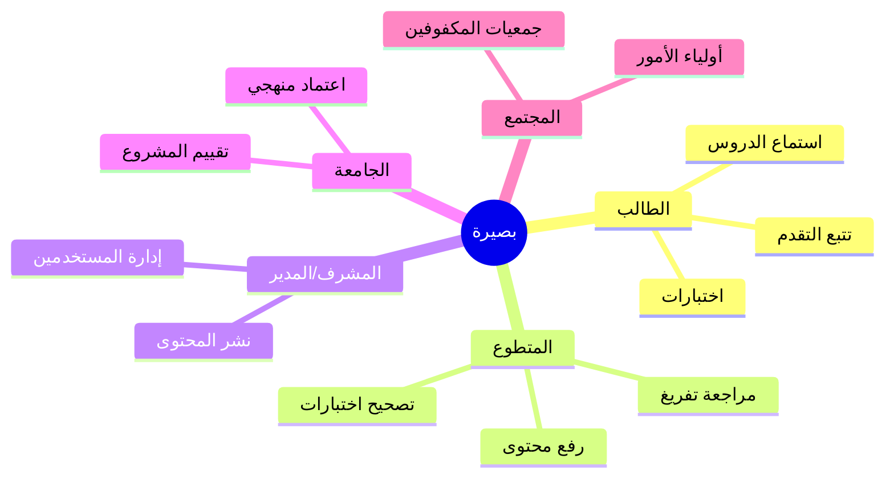
```mermaid
mindmap
  root((بصيرة))
    الطالب
      استماع الدروس
      اختبارات
      تتبع التقدم
    المتطوع
      مراجعة تفريغ
      تصحيح اختبارات
      رفع محتوى
    المشرف/المدير
      نشر المحتوى
      إدارة المستخدمين
    الجامعة
      تقييم المشروع
      اعتماد منهجي
    المجتمع
      جمعيات المكفوفين
      أولياء الأمور
```


| صاحب المصلحة       | الدور         | الاحتياجات               |
| ------------------ | ------------- | ------------------------ |
| **الطالب المكفوف** | مستخدم أساسي  | تعلم ذاتي، صوت، بساطة    |
| **المتطوع**        | إنتاج ومراجعة | واجهة مراجعة، مهام واضحة |
| **مدير النظام**    | إدارة         | لوحة Django Admin        |
| **لجنة التخرج**    | تقييم         | وثائق، عرض، اختبارات     |
| **مؤسسة تعليمية**  | محتوى         | مناهج مطابقة للصفوف      |


---


## 10. حالات الاستخدام


### 10.1 مخطط حالات الاستخدام (Use Case Diagram)

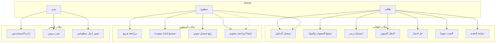
```mermaid
flowchart TB
    subgraph Actors
        S[طالب]
        V[متطوع]
        A[مدير]
    end

    subgraph StudentUC["حالات الطالب"]
        UC1[تسجيل الدخول]
        UC2[تصفح الصفوف والمواد]
        UC3[استماع درس]
        UC4[التنقل الصوتي]
        UC5[حل اختبار]
        UC6[البحث صوتياً]
        UC7[متابعة التقدم]
    end

    subgraph VolunteerUC["حالات المتطوع"]
        UC8[مراجعة تفريغ]
        UC9[تصحيح إجابة مفتوحة]
        UC10[رفع تسجيل صوتي]
        UC11[إنشاء/مراجعة محتوى]
    end

    subgraph AdminUC["حالات المدير"]
        UC12[إدارة المستخدمين]
        UC13[نشر دروس]
        UC14[تعيين أدوار متطوعين]
    end

    S --> UC1 & UC2 & UC3 & UC4 & UC5 & UC6 & UC7
    V --> UC1 & UC8 & UC9 & UC10 & UC11
    A --> UC12 & UC13 & UC14
    V -.-> UC11
```


### 10.2 جدول حالات الاستخدام التفصيلية


#### UC-03: استماع درس


| البند              | الوصف                                                                                                                         |
| ------------------ | ----------------------------------------------------------------------------------------------------------------------------- |
| **الممثل**         | طالب                                                                                                                          |
| **الشرط المسبق**   | مسجل دخول؛ الدرس منشور (published)                                                                                            |
| **التدفق الرئيسي** | 1. يختار صفاً → مادة → درس. 2. يبدأ التشغيل الصوتي. 3. النظام يحدّث LessonProgress. 4. يستخدم أوامر صوتية للتنقل بين الأقسام. |
| **التدفق البديل**  | لا يوجد ملف صوتي → قراءة TTS من transcribed_text أو text_content                                                              |
| **الشرط اللاحق**   | حفظ current_position و listening_time_seconds                                                                                 |
| **الاستثناء**      | انقطاع الشبكة → تشغيل من التخزين المحلي (مستقبلي)                                                                             |


#### UC-05: حل اختبار صوتي


| البند              | الوصف                                                                                                               |
| ------------------ | ------------------------------------------------------------------------------------------------------------------- |
| **الممثل**         | طالب                                                                                                                |
| **الشرط المسبق**   | اختبار نشط؛ لم يتجاوز max_attempts                                                                                  |
| **التدفق الرئيسي** | 1. start_attempt. 2. قراءة السؤال صوتياً. 3. إرسال إجابة (نص/صوت/اختيار). 4. submit_attempt. 5. عرض النتيجة صوتياً. |
| **التدفق البديل**  | سؤال مفتوح → needs_review=true حتى يراجع متطوع                                                                      |
| **الشرط اللاحق**   | تحديث QuizAttempt: score, percentage, passed                                                                        |


#### UC-08: مراجعة تفريغ


| البند              | الوصف                                                                                                                          |
| ------------------ | ------------------------------------------------------------------------------------------------------------------------------ |
| **الممثل**         | متطوع (دور transcriber أو reviewer)                                                                                            |
| **التدفق الرئيسي** | 1. يفتح درساً بحالة review. 2. يعدّل transcribed_text. 3. يسجل TranscriptionReview. 4. يحدّث حالة الدرس إلى approved/published |


---


## 11. رحلة المستخدم والسيناريوهات السردية

هذا الفصل يحوّل المتطلبات التقنية إلى قصص حية تساعد اللجنة والقارئ غير التقني على تخيّل المنتج.

### 11.1 شخصية الطالب: «سارة» (17 سنة)

سارة طالبة في الصف الحادي عشر، تستخدم TalkBack يومياً. تريد مراجعة دروس اللغة الإنجليزية قبل الاختبار دون انتظار تسجيلات عشوائية عبر واتساب. تدخل بصيرة، تختار صفها، ثم المادة، ثم درساً منشوراً. تبدأ بالملف الصوتي البشري، توقف مؤقتاً عند الباب، ثم تتابع من نفس الموضع. لاحقاً تطلب «قراءة النص» للمراجعة السريعة، ثم تحل اختباراً قصيراً وتسمع نتيجتها.

### 11.2 شخصية المتطوع: «أحمد»

أحمد متطوع بصوت واضح. يستلم مهمة مراجعة تفريغ درس، يعدّل النص، يعتمد المراجعة، وقد يرفع تسجيلاً بشرياً بديلاً عن TTS إن لزم.

### 11.3 مخطط رحلة الطالب

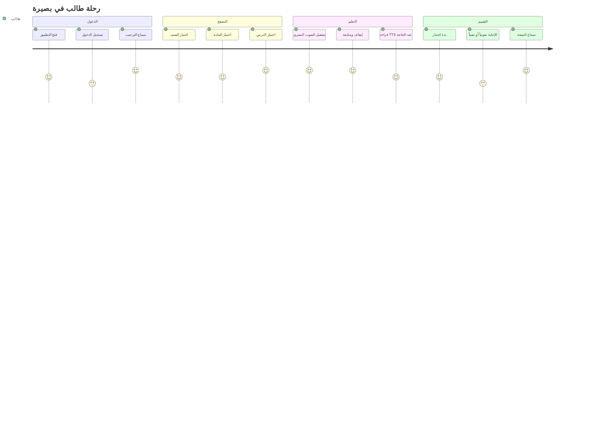
```mermaid
journey
    title رحلة طالب في بصيرة
    section الدخول
      فتح التطبيق: 4: طالب
      تسجيل الدخول: 3: طالب
      سماع الترحيب: 5: طالب
    section التصفح
      اختيار الصف: 4: طالب
      اختيار المادة: 4: طالب
      اختيار الدرس: 5: طالب
    section التعلم
      تشغيل الصوت البشري: 5: طالب
      إيقاف ومتابعة: 5: طالب
      قراءة TTS عند الحاجة: 4: طالب
    section التقييم
      بدء اختبار: 4: طالب
      الإجابة صوتياً أو نصياً: 3: طالب
      سماع النتيجة: 5: طالب
```

### 11.4 سيناريو سردي موسّع — يوم دراسي

في المساء، تفتح سارة التطبيق. يقرأ النظام ترحيباً قصيراً. تنتقل صوتياً: «الصف الحادي عشر» → «إنجليزي» → «سيرة ذاتية». يبدأ التسجيل البشري. عند الدقيقة الثالثة يرن جرس المنزل؛ تقول «توقف» أو تضغط الإيقاف المؤقت. بعد دقيقتين تتابع فيكمل من موضعها لا من البداية — نقطة حاسمة في جودة التجربة. تنهي الدرس، تحل ثلاثة أسئلة اختيار من متعدد، وتسمع: «نجحت بنسبة ثمانين بالمئة».

### 11.5 سيناريو المتطوع — ضمان الجودة

أحمد يفتح قائمة المراجعات، يستمع للمقطع، يصحح أخطاء التفريغ الآلي، يضيف ملاحظة، ويعتمد النص. يتحوّل الدرس تدريجياً نحو حالة النشر بعد مسار الاعتماد المعتمد في النظام.

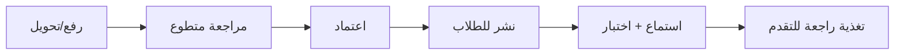
```mermaid
flowchart LR
    S1[رفع/تحويل] --> S2[مراجعة متطوع]
    S2 --> S3[اعتماد]
    S3 --> S4[نشر للطلاب]
    S4 --> S5[استماع + اختبار]
    S5 --> S6[تغذية راجعة للتقدم]
```

---


## 12. تحليل النظام ونموذج العمل

بعد تحديد الـ«ماذا»، يشرح هذا الباب الـ«كيف» على مستوى العمل ودورة حياة المحتوى قبل الدخول في تفاصيل الواجهات والجداول.


### 12.1 نموذج العمل (Business Model)

يعتمد المشروع على **نموذج مجتمعي + تقني**:

1. **إدخال المحتوى:** PDF / نص / تسجيل صوتي.
2. **المعالجة:** استخراج نص (PyPDF2/pdfplumber) → تفريغ (Whisper اختياري) → TTS (gTTS).
3. **المراجعة البشرية:** متطوعون يعتمدون النص.
4. **النشر:** حالة الدرس published.
5. **الاستهلاك:** طالب يستمع ويختبر.
6. **التقييم:** آلي + مراجعة متطوع.


### 12.2 سير عمل المحتوى (Content Lifecycle)

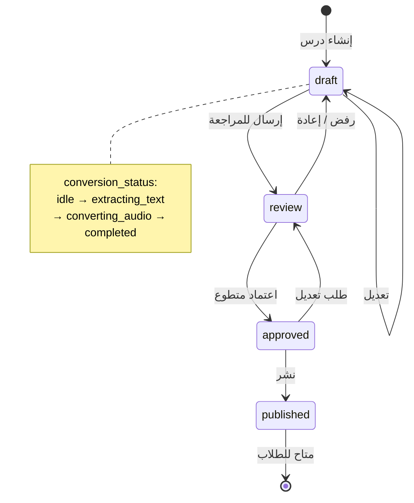
```mermaid
stateDiagram-v2
    [*] --> draft: إنشاء درس
    draft --> review: إرسال للمراجعة
    review --> approved: اعتماد متطوع
    approved --> published: نشر
    published --> [*]: متاح للطلاب

    draft --> draft: تعديل
    review --> draft: رفض / إعادة
    approved --> review: طلب تعديل

    note right of draft
        conversion_status:
        idle → extracting_text
        → converting_audio → completed
    end note
```


### 12.3 سير عمل التحويل (PDF/نص → صوت)

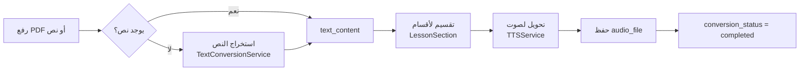
```mermaid
flowchart LR
    A[رفع PDF أو نص] --> B{يوجد نص؟}
    B -->|لا| C[استخراج النص\nTextConversionService]
    B -->|نعم| D[text_content]
    C --> D
    D --> E[تقسيم لأقسام\nLessonSection]
    E --> F[تحويل لصوت\nTTSService]
    F --> G[حفظ audio_file]
    G --> H[conversion_status = completed]
```


### 12.4 تحليل البيانات الهرمية

```
Grade (الصف الدراسي)
 └── Category (المادة الدراسية)
      ├── Lesson (الدرس)
      │    ├── LessonSection (فقرات / عناوين / نقاط)
      │    └── LessonProgress (تقدم الطالب)
      ├── Quiz (الاختبار)
      │    ├── Question
      │    │    └── QuestionChoice
      │    └── QuizAttempt
      │         └── Answer
      └── VolunteerRole (متطوع مرتبط بمادة)
```

---


### 13.0 مقدمة — قرارات معمارية للمناقشة

اعتُمد نمط **Client–Server** لفصل العرض (Flutter) عن منطق الأعمال والبيانات (Django). **مبررات هذا الاختيار أمام المشرف:**

1. **تعدد المنصات:** Flutter يخدم Android/iOS/Web من قاعدة واحدة.
2. **إدارة محتوى مركزية:** Admin + API يسمحان بإضافة دروس دون تحديث التطبيق.
3. **أمان:** Token على الخادم؛ لا تخزين كلمات مرور في التطبيق.
4. **قابلية التوسع:** ترقية SQLite → PostgreSQL دون تغيير Flutter.

## 13. تصميم النظام والبنية المعمارية

يعتمد التصميم على فصل الطبقات: عرض جوال، خدمات تطبيق، API، منطق أعمال، وبيانات/وسائط — بما يسهّل الصيانة والتوسع.


### 13.1 البنية المعمارية (Architecture)

يتبع المشروع نمط **Client-Server** مع **طبقات منفصلة**:

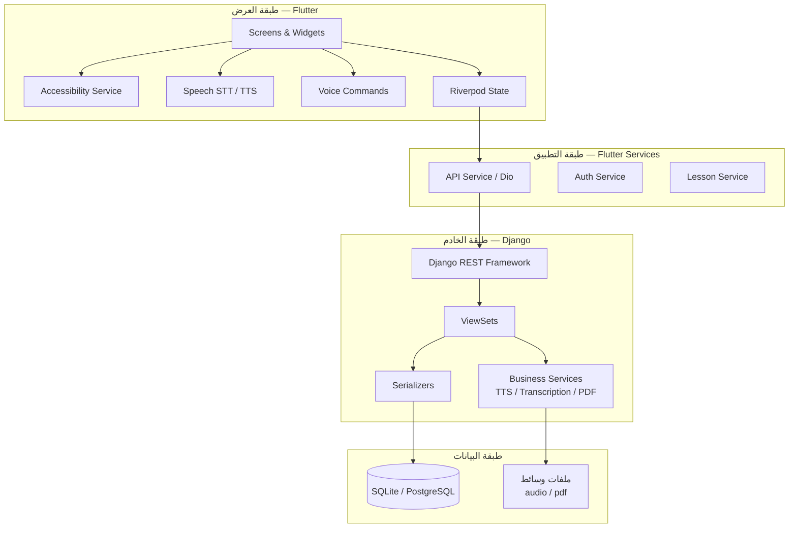
```mermaid
flowchart TB
    subgraph Presentation["طبقة العرض — Flutter"]
        UI[Screens & Widgets]
        ACC[Accessibility Service]
        SP[Speech STT / TTS]
        VC[Voice Commands]
        SM[Riverpod State]
    end

    subgraph Application["طبقة التطبيق — Flutter Services"]
        API[API Service / Dio]
        AUTH[Auth Service]
        LESSON[Lesson Service]
    end

    subgraph Backend["طبقة الخادم — Django"]
        REST[Django REST Framework]
        VIEWS[ViewSets]
        SER[Serializers]
        SERV[Business Services\nTTS / Transcription / PDF]
    end

    subgraph Data["طبقة البيانات"]
        DB[(SQLite / PostgreSQL)]
        MEDIA[ملفات وسائط\naudio / pdf]
    end

    UI --> SM --> API
    UI --> SP & VC & ACC
    API --> REST
    REST --> VIEWS --> SER --> DB
    VIEWS --> SERV --> MEDIA
```


### 13.2 مخطط المكونات (Component Diagram)

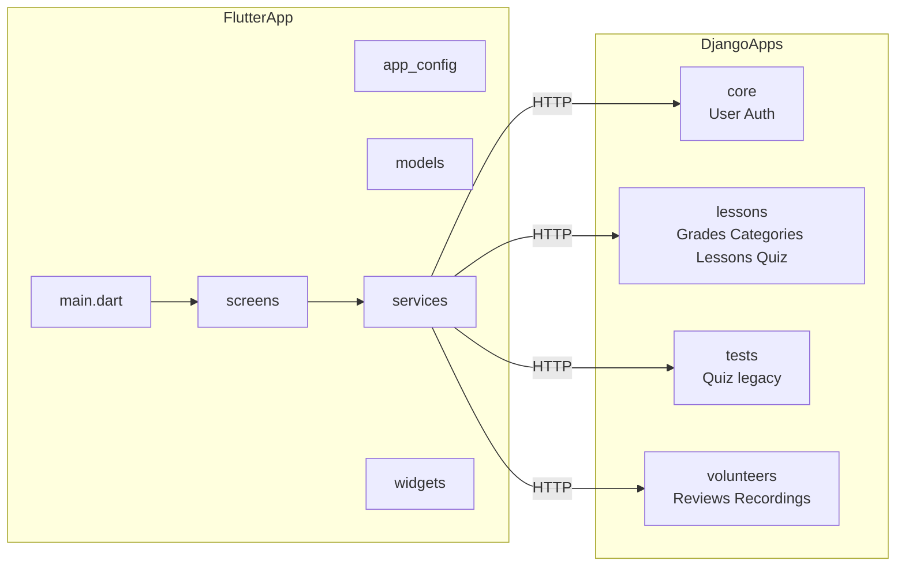
```mermaid
flowchart LR
    subgraph FlutterApp
        main[main.dart]
        config[app_config]
        models[models]
        services[services]
        screens[screens]
        widgets[widgets]
    end

    subgraph DjangoApps
        core[core\nUser Auth]
        lessons[lessons\nGrades Categories Lessons Quiz]
        tests_app[tests\nQuiz legacy]
        vol[volunteers\nReviews Recordings]
    end

    main --> screens
    screens --> services
    services -->|HTTP| core & lessons & tests_app & vol
```


### 13.3 النشر (Deployment Diagram)

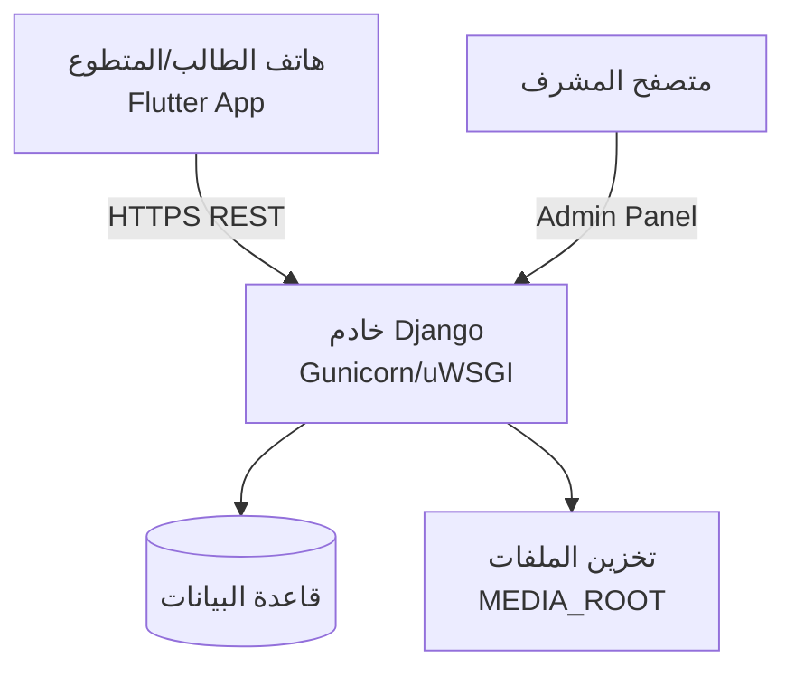
```mermaid
flowchart TB
    Phone[هاتف الطالب/المتطوع\nFlutter App]
    Phone -->|HTTPS REST| Server[خادم Django\nGunicorn/uWSGI]
    Server --> DB[(قاعدة البيانات)]
    Server --> FS[تخزين الملفات\nMEDIA_ROOT]
    Admin[متصفح المشرف] -->|Admin Panel| Server
```


---


### 14.0 مقدمة — فلسفة نموذج البيانات

صُمّم ERD ليعكس **ثلاث مجالات** مترابطة:

1. **المحتوى التعليمي:** Grade → Category → Lesson → LessonSection  
2. **التعلّم والتقييم:** LessonProgress، Quiz، Question، QuizAttempt، Answer  
3. **المجتمع والجودة:** VolunteerRole، TranscriptionReview، AudioRecording  

هذا التقسيم يسهّل على المشرف متابعة **أي جدول يخدم أي مسار** (طالب / متطوع / مدير).

## 14. مخطط الكيانات والعلاقات (ERD)


### 14.1 الكيانات الرئيسية


#### كيان المستخدم (User) — تطبيق `core`


| الحقل                     | النوع    | الوصف                       |
| ------------------------- | -------- | --------------------------- |
| id                        | PK       | معرف                        |
| username, email, password | —        | مصادقة Django               |
| user_type                 | enum     | student / volunteer / admin |
| phone_number              | string   | اختياري                     |
| created_at, updated_at    | datetime | تتبع                        |


#### كيان الصف (Grade)


| الحقل       | النوع  | الوصف       |
| ----------- | ------ | ----------- |
| id          | PK     |             |
| name        | string | اسم الصف    |
| description | text   |             |
| order       | int    | ترتيب العرض |
| is_active   | bool   |             |


#### كيان المادة (Category)


| الحقل                   | النوع      | الوصف |
| ----------------------- | ---------- | ----- |
| id                      | PK         |       |
| grade_id                | FK → Grade |       |
| name, description, icon |            |       |
| order, is_active        |            |       |


#### كيان الدرس (Lesson)


| الحقل                                  | النوع         | الوصف           |
| -------------------------------------- | ------------- | --------------- |
| id                                     | PK            |                 |
| category_id                            | FK → Category |                 |
| title, description                     |               |                 |
| audio_file, pdf_file                   | file          |                 |
| text_content, transcribed_text         | text          |                 |
| transcribed_text_reviewed              | bool          |                 |
| conversion_status, conversion_progress |               | تتبع التحويل    |
| duration, status                       |               | draft…published |
| created_by, reviewed_by                | FK → User     |                 |
| summary                                | text          | ملخص            |


#### كيان قسم الدرس (LessonSection)


| الحقل                        | النوع                       |
| ---------------------------- | --------------------------- |
| lesson_id                    | FK                          |
| section_type                 | paragraph / heading / point |
| text, order, audio_timestamp |                             |


#### كيان تقدم الدرس (LessonProgress)


| الحقل                       | النوع                |
| --------------------------- | -------------------- |
| user_id, lesson_id          | FK (unique together) |
| completed, current_position |                      |
| listening_time_seconds      |                      |


#### كيان الاختبار (Quiz) — في `lessons`


| الحقل                                         | النوع                  |
| --------------------------------------------- | ---------------------- |
| category_id, lesson_id                        | FK                     |
| quiz_type                                     | practice / exam / quiz |
| duration_minutes, passing_score, max_attempts |                        |
| status, is_active                             |                        |


#### كيان السؤال (Question) والخيار (QuestionChoice)


| Question                              | QuestionChoice                       |
| ------------------------------------- | ------------------------------------ |
| quiz_id, question_text, question_type | question_id, choice_text, is_correct |
| points, correct_answer                | order                                |


#### كيان المحاولة (QuizAttempt) والإجابة (Answer)


| QuizAttempt               | Answer                                     |
| ------------------------- | ------------------------------------------ |
| user_id, quiz_id, status  | attempt_id, question_id                    |
| score, percentage, passed | answer_text, selected_choice, answer_audio |
| time_taken_minutes        | is_correct, needs_review                   |


#### كيان دور المتطوع (VolunteerRole)


| الحقل                              | النوع                                                            |
| ---------------------------------- | ---------------------------------------------------------------- |
| user_id, role                      | reviewer / transcriber / quiz_reviewer / content_creator / admin |
| category_id                        | اختياري                                                          |
| tasks_completed, tasks_in_progress |                                                                  |


#### كيانات المتطوعين — تطبيق `volunteers`


| TranscriptionReview    | AudioRecording                 |
| ---------------------- | ------------------------------ |
| lesson_id, reviewer_id | title, audio_file, recorded_by |
| reviewed_text, status  | status: pending → published    |
| comments               | transcribed_text, notes        |


### 14.2 مخطط ERD (Mermaid)

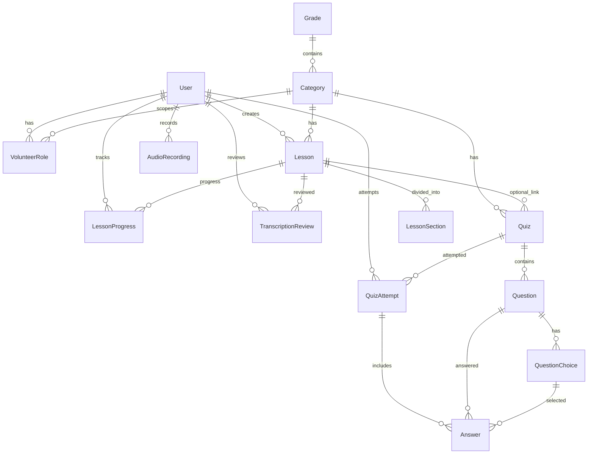
```mermaid
erDiagram
    User ||--o{ LessonProgress : tracks
    User ||--o{ QuizAttempt : attempts
    User ||--o{ VolunteerRole : has
    User ||--o{ Lesson : creates
    User ||--o{ TranscriptionReview : reviews

    Grade ||--o{ Category : contains
    Category ||--o{ Lesson : has
    Category ||--o{ Quiz : has
    Category ||--o{ VolunteerRole : scopes

    Lesson ||--o{ LessonSection : divided_into
    Lesson ||--o{ LessonProgress : progress
    Lesson ||--o{ Quiz : optional_link
    Lesson ||--o{ TranscriptionReview : reviewed

    Quiz ||--o{ Question : contains
    Question ||--o{ QuestionChoice : has
    Quiz ||--o{ QuizAttempt : attempted

    QuizAttempt ||--o{ Answer : includes
    Question ||--o{ Answer : answered
    QuestionChoice ||--o{ Answer : selected

    User ||--o{ AudioRecording : records
```


### 14.3 قاموس البيانات (Data Dictionary) — ملخص العلاقات


| العلاقة                          | النوع | القيود                     |
| -------------------------------- | ----- | -------------------------- |
| Grade → Category                 | 1:N   | on delete CASCADE          |
| Category → Lesson                | 1:N   |                            |
| Lesson → LessonSection           | 1:N   | ترتيب بـ order             |
| User + Lesson → LessonProgress   | N:M   | unique_together            |
| Quiz → Question → QuestionChoice | 1:N:N |                            |
| QuizAttempt → Answer             | 1:N   | unique (attempt, question) |


---


## 15. مخططات UML


### 15.1 مخطط الفئات (Class Diagram) — منطق المجال

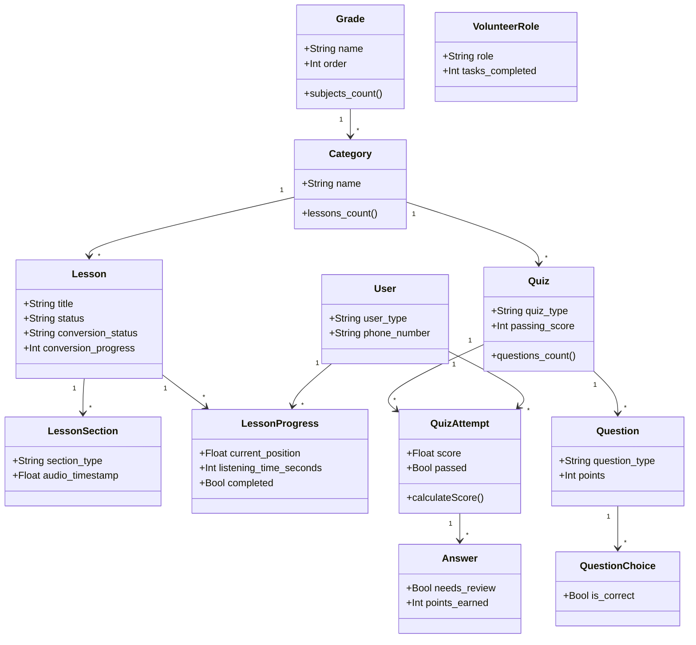
```mermaid
classDiagram
    class User {
        +String user_type
        +String phone_number
    }

    class Grade {
        +String name
        +Int order
        +subjects_count()
    }

    class Category {
        +String name
        +lessons_count()
    }

    class Lesson {
        +String title
        +String status
        +String conversion_status
        +Int conversion_progress
    }

    class LessonSection {
        +String section_type
        +Float audio_timestamp
    }

    class LessonProgress {
        +Float current_position
        +Int listening_time_seconds
        +Bool completed
    }

    class Quiz {
        +String quiz_type
        +Int passing_score
        +questions_count()
    }

    class Question {
        +String question_type
        +Int points
    }

    class QuestionChoice {
        +Bool is_correct
    }

    class QuizAttempt {
        +Float score
        +Bool passed
        +calculateScore()
    }

    class Answer {
        +Bool needs_review
        +Int points_earned
    }

    class VolunteerRole {
        +String role
        +Int tasks_completed
    }

    Grade "1" --> "*" Category
    Category "1" --> "*" Lesson
    Lesson "1" --> "*" LessonSection
    User "1" --> "*" LessonProgress
    Lesson "1" --> "*" LessonProgress
    Category "1" --> "*" Quiz
    Quiz "1" --> "*" Question
    Question "1" --> "*" QuestionChoice
    User "1" --> "*" QuizAttempt
    Quiz "1" --> "*" QuizAttempt
    QuizAttempt "1" --> "*" Answer
```


### 15.2 مخطط تسلسل — تسجيل الدخول واستماع درس

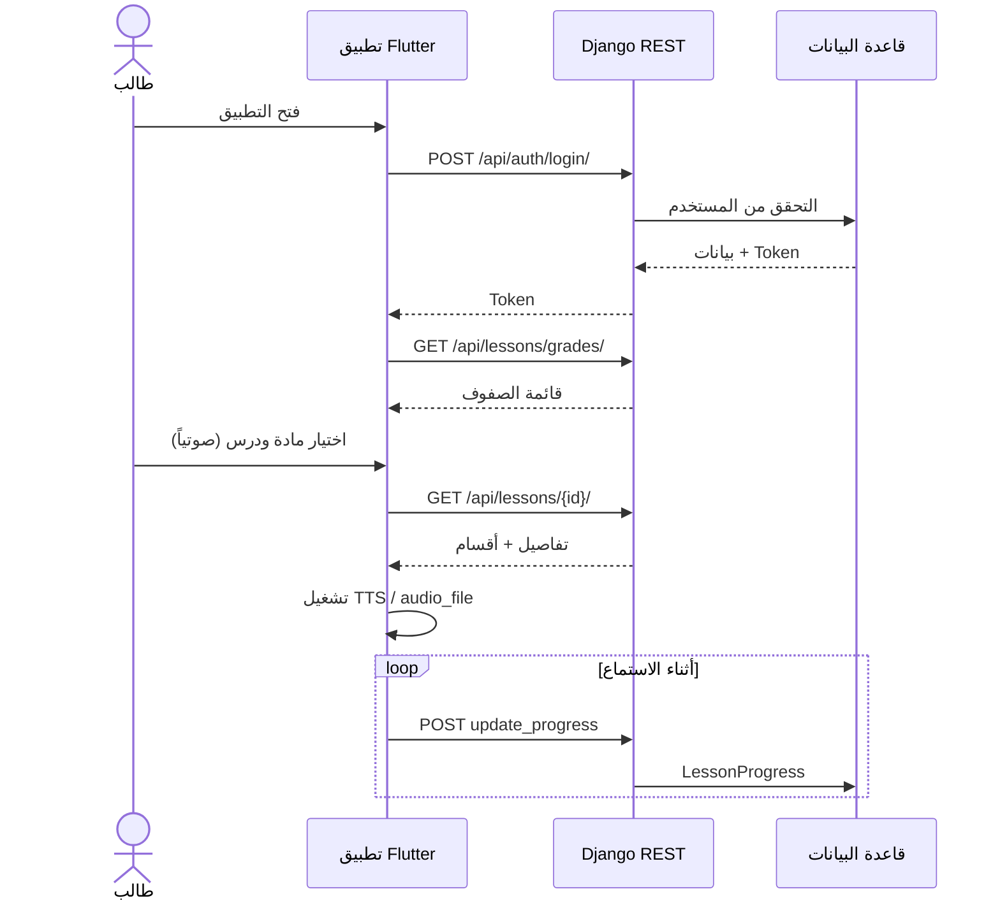
```mermaid
sequenceDiagram
    actor Student as طالب
    participant App as تطبيق Flutter
    participant API as Django REST
    participant DB as قاعدة البيانات

    Student->>App: فتح التطبيق
    App->>API: POST /api/auth/login/
    API->>DB: التحقق من المستخدم
    DB-->>API: بيانات + Token
    API-->>App: Token
    App->>API: GET /api/lessons/grades/
    API-->>App: قائمة الصفوف
    Student->>App: اختيار مادة ودرس (صوتياً)
    App->>API: GET /api/lessons/{id}/
    API-->>App: تفاصيل + أقسام
    App->>App: تشغيل TTS / audio_file
    loop أثناء الاستماع
        App->>API: POST update_progress
        API->>DB: LessonProgress
    end
```


### 15.3 مخطط تسلسل — إنهاء اختبار

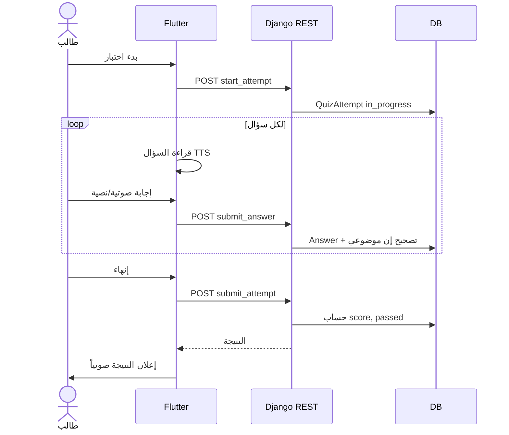
```mermaid
sequenceDiagram
    actor Student as طالب
    participant App as Flutter
    participant API as Django REST
    participant DB as DB

    Student->>App: بدء اختبار
    App->>API: POST start_attempt
    API->>DB: QuizAttempt in_progress
    loop لكل سؤال
        App->>App: قراءة السؤال TTS
        Student->>App: إجابة صوتية/نصية
        App->>API: POST submit_answer
        API->>DB: Answer + تصحيح إن موضوعي
    end
    Student->>App: إنهاء
    App->>API: POST submit_attempt
    API->>DB: حساب score, passed
    API-->>App: النتيجة
    App->>Student: إعلان النتيجة صوتياً
```


### 15.4 مخطط تسلسل — مراجعة متطوع

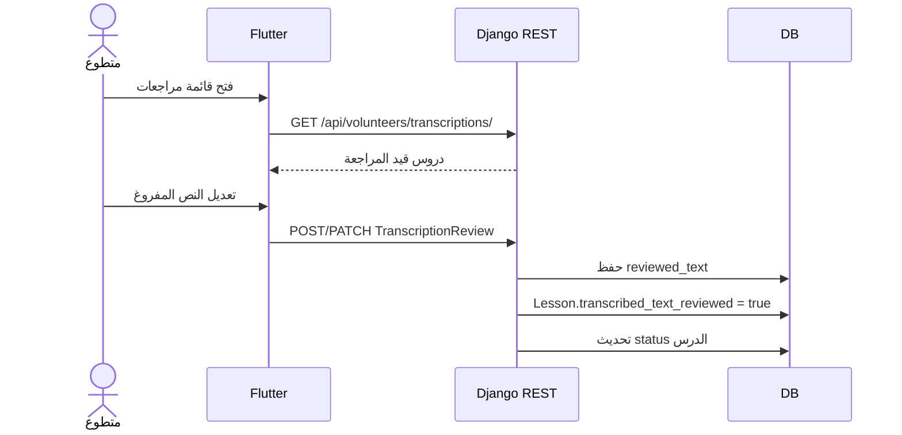
```mermaid
sequenceDiagram
    actor Vol as متطوع
    participant App as Flutter
    participant API as Django REST
    participant DB as DB

    Vol->>App: فتح قائمة مراجعات
    App->>API: GET /api/volunteers/transcriptions/
    API-->>App: دروس قيد المراجعة
    Vol->>App: تعديل النص المفروغ
    App->>API: POST/PATCH TranscriptionReview
    API->>DB: حفظ reviewed_text
    API->>DB: Lesson.transcribed_text_reviewed = true
    API->>DB: تحديث status الدرس
```


---


## 16. مخططات التدفق والنشاط والسياق


### 16.1 مخطط تدفق البيانات (DFD) — المستوى 0

```mermaid
flowchart LR
    Student([طالب])
    Volunteer([متطوع])
    Admin([مدير])

    System{{نظام بصيرة}}

    Student -->|طلب دروس / إجابات| System
    System -->|صوت / نتائج| Student

    Volunteer -->|مراجعات / تسجيلات| System
    System -->|مهام مراجعة| Volunteer

    Admin -->|إدارة محتوى| System
    System -->|تقارير| Admin

    System --> DB[(قاعدة بيانات)]
    System --> Files[ملفات وسائط]
```


### 16.2 مخطط نشاط — التنقل الصوتي أثناء الدرس

```mermaid
flowchart TD
    Start([بدء الدرس]) --> Play[تشغيل القسم الحالي]
    Play --> Listen{أمر صوتي؟}

    Listen -->|التالي| Next[القسم التالي]
    Listen -->|السابق| Prev[القسم السابق]
    Listen -->|أعد| Play
    Listen -->|توقف| Pause[إيقاف مؤقت]
    Listen -->|استمر| Play
    Listen -->|ابحث عن| Search[بحث في النص]
    Listen -->|لا أمر| Play

    Next --> UpdateProg[تحديث الموضع]
    Prev --> UpdateProg
    UpdateProg --> CheckEnd{آخر قسم؟}
    CheckEnd -->|نعم| Complete[وضع completed=true]
    CheckEnd -->|لا| Play
    Pause --> Listen
    Search --> Play
    Complete --> End([إنهاء])
```


### 16.3 مخطط نشاط — تصحيح الإجابة

```mermaid
flowchart TD
    A[استلام إجابة] --> B{نوع السؤال؟}
    B -->|اختيار متعدد / صح خطأ| C[مقارنة مع is_correct]
    C --> D[حساب points_earned]
    B -->|مفتوح / صوتي| E[needs_review = true]
    E --> F[انتظار متطوع]
    F --> G[مراجعة يدوية]
    G --> D
    D --> H[تحديث مجموع المحاولة]
```


---


## 17. تصميم واجهات البرمجة (API)


### 17.1 هيكل عناوين API


| المجال                   | المسار الأساسي     |
| ------------------------ | ------------------ |
| المصادقة                 | `/api/auth/`       |
| الدروس والصفوف           | `/api/lessons/`    |
| الاختبارات (تطبيق tests) | `/api/tests/`      |
| المتطوعون                | `/api/volunteers/` |
| الإدارة                  | `/admin/`          |


### 17.2 نقاط النهاية الرئيسية


#### المصادقة (`core`)


| Method | Endpoint              | الوصف              |
| ------ | --------------------- | ------------------ |
| POST   | `/api/auth/register/` | تسجيل حساب         |
| POST   | `/api/auth/login/`    | تسجيل دخول → Token |
| GET    | `/api/auth/profile/`  | الملف الشخصي       |


#### الدروس (`lessons`)


| Method   | Endpoint                             | الوصف           |
| -------- | ------------------------------------ | --------------- |
| GET      | `/api/lessons/grades/`               | الصفوف          |
| GET      | `/api/lessons/categories/`           | المواد          |
| GET      | `/api/lessons/`                      | الدروس          |
| GET      | `/api/lessons/{id}/`                 | تفاصيل درس      |
| POST     | `/api/lessons/{id}/update_progress/` | تحديث التقدم    |
| GET      | `/api/lessons/{id}/get_progress/`    | قراءة التقدم    |
| GET      | `/api/lessons/search/?q=`            | بحث             |
| GET/POST | `/api/lessons/volunteer-roles/`      | أدوار المتطوعين |


#### الاختبارات (`tests`)


| Method | Endpoint                          | الوصف          |
| ------ | --------------------------------- | -------------- |
| GET    | `/api/tests/`                     | قائمة اختبارات |
| GET    | `/api/tests/{id}/`                | تفاصيل         |
| POST   | `/api/tests/{id}/start_attempt/`  | بدء محاولة     |
| POST   | `/api/tests/{id}/submit_answer/`  | إرسال إجابة    |
| POST   | `/api/tests/{id}/submit_attempt/` | إنهاء          |


#### المتطوعون (`volunteers`)


| Method   | Endpoint                          | الوصف           |
| -------- | --------------------------------- | --------------- |
| GET/POST | `/api/volunteers/transcriptions/` | مراجعات التفريغ |
| GET/POST | `/api/volunteers/recordings/`     | تسجيلات صوتية   |


### 17.3 نموذج الاستجابة (مثال درس)

```json
{
  "id": 1,
  "title": "مقدمة في الجبر",
  "category": 3,
  "audio_file": "/media/lessons/audio/lesson1.mp3",
  "transcribed_text": "...",
  "sections": [
    {
      "section_type": "heading",
      "text": "الفصل الأول",
      "order": 0,
      "audio_timestamp": 0.0
    }
  ],
  "status": "published",
  "conversion_status": "completed"
}
```

---


## 18. خريطة الشاشات وتجربة الاستخدام

### 18.1 شجرة التنقّل

```mermaid
flowchart TD
    Login[تسجيل الدخول] --> Home[الرئيسية: الصفوف]
    Home --> Subjects[مواد الصف]
    Subjects --> Lessons[دروس المادة]
    Lessons --> Detail[تفاصيل الدرس]
    Detail --> Audio[مشغّل الملف الصوتي]
    Detail --> TTS[قراءة النص TTS]
    Detail --> Voice[أوامر صوتية]
    Home --> Quizzes[شاشة الاختبارات]
    Quizzes --> Take[حل الاختبار]
    Home --> Upload[رفع درس - إدارة]
```

### 18.2 مبادئ واجهة الدرس

1. **أعلى الشاشة:** مشغّل الملف الصوتي (التسجيل البشري) مع شريط تقدّم وإيقاف/متابعة/إيقاف تام.
2. **أسفلها:** وصف الدرس ثم أدوات قراءة النص المفروغ (TTS) مع إيقاف مؤقت ومتابعة وإعادة.
3. **زر عائم:** الميكروفون للأوامر الصوتية.
4. **التعارض ممنوع:** لا تشغيل متزامن للملف وTTS.

### 18.3 اعتبارات TalkBack/VoiceOver

- تسميات واضحة للأزرار (`tooltip` وSemantics).
- أهداف لمس كبيرة عبر `accessible_button` و`accessible_list_tile`.
- إعلانات قصيرة عبر `accessibility_service` عند الأحداث المهمة.
- تجنّب الاعتماد على اللون وحده لإيصال الحالة.

### 18.4 الهوية البصرية المعتمدة في المنتج

اعتمد التطبيق لوحة ألوان ثابتة تعكس اسم **بصيرة** (الإدراك) لا الألوان الافتراضية لمكتبة Material:

| العنصر | القيمة | الدلالة |
| ------ | ------ | ------- |
| الأساسي | `#1B4F72` نيلي | عمق، ثقة، إدراك |
| الثانوي | `#148F77` فيروزي | صوت، حياة، تعلم |
| التأكيد | `#D4A017` ذهبي | نجاح / إجراء مهم |
| الخلفية | `#F4F7FB` | تباين عالٍ مع النص الداكن |

وتُطبَّق الهوية عبر `AppTheme` ومكوّنات مشتركة (`BaseraGradientCard`, `BaseraSurfaceCard`, `BaseraEmptyState`) لضمان اتساق الشاشات وإمكانية الوصول (تباين كافٍ، أزرار ≥ 48px).

---


## 19. البنية البرمجية للمشروع


### 19.1 هيكل المجلدات

```
basera/
├── backend/                    # Django
│   ├── basera_backend/         # إعدادات المشروع
│   ├── core/                   # المستخدم والمصادقة
│   ├── lessons/                # صفوف، مواد، دروس، اختبارات موسعة
│   │   ├── models.py
│   │   ├── views.py
│   │   ├── tts_service.py
│   │   ├── transcription_service.py
│   │   └── text_conversion_service.py
│   ├── tests/                  # اختبارات مرتبطة بالدرس (نسخة مبسطة)
│   ├── volunteers/             # مراجعات وتسجيلات
│   └── requirements.txt
├── lib/                        # Flutter (واجهة المستخدم)
│   ├── config/app_config.dart
│   ├── models/
│   ├── services/
│   ├── screens/
│   └── widgets/
├── pubspec.yaml
└── README.md
```


### 19.2 تطبيقات Django والمسؤوليات


| التطبيق        | المسؤولية                                             |
| -------------- | ----------------------------------------------------- |
| **core**       | User مخصص، تسجيل، Token                               |
| **lessons**    | المحتوى التعليمي، الاختبارات الكاملة، VolunteerRole   |
| **tests**      | ViewSets للاختبارات (نموذج Quiz مبسط مرتبط بـ Lesson) |
| **volunteers** | TranscriptionReview، AudioRecording                   |


### 19.3 خدمات الخادم (Backend Services)


| الخدمة                | الملف                        | الوظيفة                 |
| --------------------- | ---------------------------- | ----------------------- |
| TextConversionService | `text_conversion_service.py` | استخراج نص من PDF       |
| TranscriptionService  | `transcription_service.py`   | تفريغ صوت (Whisper)     |
| TTSService            | `tts_service.py`             | تحويل نص إلى صوت (gTTS) |


### 19.4 طبقة Flutter (المخطط)


| الطبقة  | المكونات                                                                                                |
| ------- | ------------------------------------------------------------------------------------------------------- |
| العرض   | login_screen, home_screen, category_lessons_screen, lesson_detail_screen                                |
| الحالة  | Riverpod                                                                                                |
| الخدمات | api_service, auth_service, lesson_service, speech_service, voice_command_service, accessibility_service |
| التخزين | shared_preferences, hive                                                                                |


### 19.5 الأوامر الصوتية المدعومة


| الأمر      | الإجراء               |
| ---------- | --------------------- |
| التالي     | العنصر/القسم التالي   |
| السابق     | العنصر السابق         |
| أعد        | إعادة التشغيل/القراءة |
| توقف       | إيقاف مؤقت            |
| استمر      | متابعة                |
| الرئيسية   | العودة للرئيسية       |
| الخلف      | رجوع                  |
| ابحث عن... | بحث في المحتوى        |


---


## 20. التحكم الصوتي المزدوج في الدرس

يُعد هذا الفصل توثيقاً لفكرة مركزية ظهرت أثناء التنفيذ والاختبار: المستخدم يتعامل مع **صوتين مختلفين** في شاشة واحدة.

### 20.1 المسار الأول — الملف الصوتي البشري

- التقنية: `audioplayers` مع حفظ موضع التشغيل.
- الحالات: تشغيل، إيقاف مؤقت، متابعة من نفس الموضع، إيقاف تام، إعادة من البداية.
- التحدي على الويب: تجنّب `seek(0)` عند المتابعة حتى لا يُلغى موضع المتصفح.

### 20.2 المسار الثاني — القراءة الآلية TTS

- التقنية: `flutter_tts` عبر `SpeechService`.
- الإيقاف المؤقت يستفيد من `pause()` الأصلي للمنصة.
- المتابعة تتم دون `stop()` حتى لا تُفقد الجلسة المتوقفة مؤقتاً.

### 20.3 مخطط الحالة الموحّد

```mermaid
stateDiagram-v2
    [*] --> Idle
    Idle --> PlayingFile: تشغيل ملف
    Idle --> SpeakingTTS: قراءة نص
    PlayingFile --> PausedFile: إيقاف مؤقت
    PausedFile --> PlayingFile: متابعة
    PlayingFile --> Idle: إيقاف تام
    SpeakingTTS --> PausedTTS: إيقاف مؤقت
    PausedTTS --> SpeakingTTS: متابعة
    SpeakingTTS --> Idle: إيقاف
    PlayingFile --> Idle: بدء TTS يوقف الملف
    SpeakingTTS --> Idle: بدء الملف يوقف TTS
```

### 20.4 الأوامر الصوتية المرتبطة بالتشغيل

| الأمر | السلوك المتوقع |
| ----- | --------------- |
| توقف / أوقف | إيقاف مؤقت للمسار النشط |
| استمر / متابعة / استئناف | متابعة من نفس الموضع |
| أعد / كرر | إعادة من البداية |
| اقرأ / قراءة | تشغيل TTS للنص المفروغ |
| تشغيل / ابدأ | تشغيل الملف الصوتي |

---


## 21. التقنيات والأدوات


### 21.1 جدول التقنيات


| الطبقة       | التقنية                             | الإصدار / الملاحظة         |
| ------------ | ----------------------------------- | -------------------------- |
| Frontend     | Flutter                             | SDK ^3.7.2                 |
| إدارة الحالة | flutter_riverpod                    | ^2.5.1                     |
| STT          | speech_to_text                      | ^7.0.0                     |
| TTS          | flutter_tts                         | 3.8.3                      |
| صوت          | audioplayers, audio_service, record |                            |
| شبكة         | dio, http                           |                            |
| تخزين محلي   | hive, shared_preferences            |                            |
| Backend      | Django                              | 4.2.x                      |
| API          | Django REST Framework               | ≥3.14                      |
| CORS         | django-cors-headers                 |                            |
| قاعدة بيانات | SQLite (تطوير)                      | قابل للترقية لـ PostgreSQL |
| تفريغ        | OpenAI Whisper                      | اختياري                    |
| PDF          | PyPDF2, pdfplumber                  |                            |
| TTS خادم     | gTTS                                |                            |
| معالجة صوت   | pydub, ffmpeg-python                |                            |


### 21.2 مخطط التكامل التقني

```mermaid
flowchart TB
    subgraph Mobile
        STT[speech_to_text]
        TTS[flutter_tts]
        AP[audioplayers]
    end

    subgraph Server
        DJ[Django REST]
        WH[Whisper]
        GT[gTTS]
        PDF[PyPDF2]
    end

    STT -->|أوامر وإجابات| DJ
    DJ --> WH & PDF & GT
    GT -->|ملفات صوت| AP
    DJ -->|JSON + URLs| Mobile
```


---


## 22. إمكانية الوصول والأمان


### 22.1 إمكانية الوصول (Accessibility)


| المبدأ          | التطبيق في بصيرة                                    |
| --------------- | --------------------------------------------------- |
| **إدراكي**      | الاعتماد على الصوت بدل الألوان والرسوم              |
| **تشغيلي**      | أزرار كبيرة (accessible_button)، قوائم قابلة للوصول |
| **قارئ الشاشة** | دعم TalkBack و VoiceOver عبر accessibility_service  |
| **تفاعل صوتي**  | voice_command_service للتنقل دون لمس                |


### 22.2 الأمان


| الجانب    | الآلية                                           |
| --------- | ------------------------------------------------ |
| المصادقة  | Token Authentication (DRF)                       |
| الصلاحيات | تمييز user_type و VolunteerRole                  |
| الملفات   | رفع ضمن MEDIA_ROOT مع صلاحيات Django             |
| الإنتاج   | SECRET_KEY من متغيرات البيئة، DEBUG=False، HTTPS |
| CORS      | django-cors-headers للتحكم بالنطاقات             |


### 22.3 الخصوصية

- بيانات التقدم مرتبطة بالمستخدم ولا تُشارك بين الطلاب.
- ملفات الإجابات الصوتية في مسارات معزولة (`quizzes/audio_answers/`).

---


## 23. خطة الاختبار


### 23.1 أنواع الاختبار


| النوع                   | الهدف                     | أمثلة                         |
| ----------------------- | ------------------------- | ----------------------------- |
| **وحدة (Unit)**         | نماذج Django، حساب الدرجة | QuizAttempt.score             |
| **تكامل (Integration)** | API endpoints             | start_attempt → submit_answer |
| **واجهة (UI)**          | Flutter widgets           | AccessibleButton              |
| **إمكانية وصول**        | TalkBack                  | التنقل في home_screen         |
| **صوت (Manual)**        | STT/TTS عربي              | أوامر "التالي"، قراءة درس     |
| **أداء**                | تحميل قائمة دروس          | < 2 ثانية                     |
| **قبول (UAT)**          | سيناريوهات طالب حقيقي     | استماع درس كامل + اختبار      |


### 23.2 مصفوفة تتبع المتطلبات ↔ الاختبارات


| المتطلب            | حالة الاختبار المقترحة               |
| ------------------ | ------------------------------------ |
| FR-03 تصفح هرمي    | GET grades → categories → lessons    |
| FR-06 تتبع تقدم    | POST update_progress ثم GET          |
| FR-09 تصحيح آلي    | إجابة خاطئة/صحيحة لـ multiple_choice |
| FR-10 مراجعة يدوية | Answer.needs_review بعد open_ended   |
| NFR-01 TalkBack    | فحص يدوي على جهاز Android            |


### 23.3 حالات اختبار نموذجية


| ID    | الخطوات             | النتيجة المتوقعة            |
| ----- | ------------------- | --------------------------- |
| TC-01 | تسجيل طالب جديد     | حساب user_type=student      |
| TC-02 | استماع درس 5 دقائق  | listening_time_seconds يزيد |
| TC-03 | تجاوز max_attempts  | رفض start_attempt           |
| TC-04 | متطوع يعتمد تفريغاً | status=approved للمراجعة    |


---


## 24. خطة التنفيذ والجدول الزمني


### 24.1 مراحل المشروع (مقترحة لمشروع تخرج)

```mermaid
gantt
    title خطة تنفيذ مشروع بصيرة
    dateFormat  YYYY-MM
    section التحليل
    دراسة المتطلبات والأدبيات     :a1, 2025-09, 1M
    section التصميم
    ERD وUML وAPI                 :a2, after a1, 1M
    section التطوير
    Backend Django                :b1, after a2, 2M
    Flutter واجهات أساسية         :b2, after a2, 2M
    STT/TTS وتكامل صوتي          :b3, after b1, 1M
    نظام اختبارات ومتطوعين       :b4, after b3, 1M
    section الاختبار والتوثيق
    اختبار و UAT                  :c1, after b4, 1M
    إعداد التقرير والعرض          :c2, after c1, 1M
```


### 24.2 توزيع العمل (Roles)


| المرحلة      | Backend  | Frontend | توثيق        |
| ------------ | -------- | -------- | ------------ |
| تحليل وتصميم | مشاركة   | مشاركة   | كامل         |
| محتوى وAPI   | رئيسي    | تكامل    | API docs     |
| صوت وUX      | دعم      | رئيسي    | دليل مستخدم  |
| اختبار       | Unit/API | UI/A11y  | تقرير اختبار |


---


## 25. منهجية التطوير وإدارة المشروع

### 25.1 المنهج

اعتمد المشروع أسلوباً **تكرارياً (Iterative)** قريباً من Agile الخفيف: تحليل أولي، تصميم نماذج، بناء Backend، بناء واجهات Flutter، دمج الصوت، ثم اختبار وتحسين التحكم بالتشغيل.

```mermaid
flowchart LR
    A[تحليل] --> B[تصميم]
    B --> C[تطوير Backend]
    C --> D[تطوير Flutter]
    D --> E[تكامل صوتي]
    E --> F[اختبار وتحسين]
    F --> B
```

### 25.2 أدوات العمل

| المجال | الأداة |
| ------ | ------ |
| إصدار الكود | Git |
| Backend | Django + DRF + SQLite (تطوير) |
| Frontend | Flutter / Dart |
| توثيق | Markdown + Mermaid |
| إدارة محتوى تجريبي | Django Admin |

### 25.3 معايير قبول المسار الأساسي (Definition of Done)

- طالب يسجّل دخولاً ويتصفح حتى درس منشور.
- يستمع ويوقف ويتابع من نفس الموضع.
- يحدّث تقدمه عبر API.
- يبدأ اختباراً ويحصل على نتيجة للأسئلة الموضوعية.
- متطوع يمكنه تسجيل مراجعة تفريغ (وفق الواجهات المتاحة).

---


## 26. القيود والتحديات


| التحدي                           | التأثير                 | التخفيف                              |
| -------------------------------- | ----------------------- | ------------------------------------ |
| دقة STT للعربية                  | أخطاء في الأوامر        | قوائم أوامر محددة + تأكيد صوتي       |
| جودة TTS                         | تجربة استماع            | السماح بملفات صوتية بشرية            |
| حجم نماذج Whisper                | بطء على خادم ضعيف       | معالجة غير متزامنة + حالة conversion |
| ازدواجية Quiz في lessons و tests | تعقيد صيانة             | توحيد النماذج مستقبلاً (ملحق أ)      |
| بناء مكتبة محتوى                 | وقت طويل                | الاعتماد على المتطوعين               |
| Offline غير مكتمل                | استخدام بدون شبكة محدود | Hive + مزامنة لاحقة                  |


---


## 27. الأثر التعليمي والاجتماعي المتوقع

### 27.1 على الطالب

- استقلال أكبر في المذاكرة.
- تقليل الاعتماد على وسيط بشري دائم.
- إحساس أوضح بالتقدّم عبر الوقت والاختبارات.

### 27.2 على المتطوع والمؤسسة

- قناة منظمة للمساهمة بدل الجهود المتفرقة.
- إمكانية ربط المحتوى بصفوف ومواد رسمية.
- نواة لشراكات مع جمعيات المكفوفين والمدارس.

### 27.3 على البحث والتخرج

- نموذج تطبيقي لمشكلة Accessibility في السياق العربي.
- وثيقة تصميم قابلة لإعادة الاستخدام في مشاريع لاحقة.
- أساس لبحوث تجريبية (قياس زمن إكمال درس، دقة الأوامر، رضا المستخدم).

```mermaid
flowchart TB
    Product[منصة بصيرة] --> S[أثر على الطالب]
    Product --> V[أثر على المتطوع]
    Product --> I[أثر مؤسسي]
    Product --> R[أثر بحثي]
```

---


## 28. الأعمال المستقبلية

- [ ] تكامل Whisper محسّن للتفريغ العربي
- [ ] تلخيص ذكي بالذكاء الاصطناعي
- [ ] عمل كامل دون إنترنت (تنزيل الدروس)
- [ ] إحصائيات تقدم متقدمة ولوحة تحكم
- [ ] إشعارات (درس جديد، نتيجة اختبار)
- [ ] دعم لغات إضافية
- [ ] ترقية قاعدة البيانات إلى PostgreSQL للإنتاج
- [ ] توحيد نماذج الاختبارات بين تطبيقي `lessons` و `tests`

---

## 29. الخلاصة والتوصيات للمشرف

### 29.1 الخلاصة

مشروع **بصيرة** ليس مجرد تطبيق يقرأ النص بصوت مرتفع؛ إنه محاولة لإعادة تعريف تجربة التعلّم الرقمي للمكفوفين في السياق العربي: محتوى هرمي يعكس المدرسة والجامعة، تفاعل صوتي كامل، تقييم عادل، ومجتمع متطوعين يحرس الجودة.

من الناحية **الإنسانية**، ينحاز المشروع إلى الاستقلالية والكرامة. ومن الناحية **الهندسية**، يقدّم بنية Client–Server، نماذج بيانات قابلة للتوسع، مخططات تحليل وتصميم متكاملة، ونموذجاً أولياً قابلاً للتشغيل.

قيمة بصيرة تُقاس بقدرة طالبٍ على إكمال **درس واختبار** بصوته ويده، دون أن يشعر أن التقنية صُممت لغيره. بهذا يجمع المشروع بين هندسة البرمجيات وفلسفة الإتاحة في منتج واحد قابل للنقاش الأكاديمي.

### 29.2 التوصيات للمشرف — نقاط متابعة مقترحة

| # | التوصية | الغرض |
| - | ------- | ----- |
| 1 | اعتماد **نطاق محتوى تجريبي** (صف واحد، 2–3 مواد، 5–10 دروس) | تجنب تضخم المشروع |
| 2 | جدولة **UAT** مع مستخدم من الفئة المستهدفة إن أمكن | تقويم Audio-first |
| 3 | مطالبة الطالب بـ **توحيد Quiz** أو تبرير الازدواجية | نضج هندسي |
| 4 | مراجعة **شاشة الدرس** (باب 20) في العرض الحي | إثبات الإيقاف/المتابعة |
| 5 | ربط كل مخطط UML/ERD **بملف في الكود** | اتساق التحليل والتنفيذ |
| 6 | إعداد **15 شريحة** (ملحق ز) + demo 3–5 دقائق | جاهزية المناقشة |

### 29.3 ما يُتوقع من الطالب عند التسليم

1. هذه الوثيقة (محدّثة).
2. تطبيق قابل للتشغيل + Backend.
3. محتوى تجريبي في Admin.
4. تقرير اختبار مختصر.
5. عرض تقديمي وفيديو demo.

---

## 30. قاموس المصطلحات

| المصطلح | التعريف الموجز |
| ------- | --------------- |
| Audio-first | منهج تصميم يجعل الصوت القناة الأساسية لإنجاز المهام |
| STT | Speech-to-Text: تحويل الكلام إلى نص |
| TTS | Text-to-Speech: قراءة النص صوتياً |
| TalkBack | قارئ شاشة Android |
| VoiceOver | قارئ شاشة iOS |
| Grade | الصف الدراسي في هرم المحتوى |
| Category | المادة الدراسية المرتبطة بصف |
| Lesson | وحدة الدرس التعليمية |
| LessonSection | فقرة/عنوان/نقطة داخل الدرس |
| LessonProgress | تتبع موضع ووقت استماع الطالب |
| Quiz / Question | الاختبار وأسئلته |
| QuizAttempt | محاولة طالب لاختبار |
| VolunteerRole | دور المتطوع وصلاحياته |
| TranscriptionReview | مراجعة بشرية للتفريغ النصي |
| conversion_status | حالة تحويل PDF/نص إلى صوت |
| Token Authentication | مصادقة عبر رمز يُرسل مع طلبات API |
| Mermaid | لغة نصية لرسم المخططات داخل Markdown |
| ERD | مخطط الكيانات والعلاقات |
| UML | لغة النمذجة الموحّدة |
| DFD | مخطط تدفق البيانات |
| UAT | اختبار قبول المستخدم |
| Offline | العمل دون اتصال بالإنترنت |
| Flutter | إطار لبناء تطبيقات جوال متعددة المنصات |
| Django REST Framework | بناء واجهات API فوق Django |

---

## 31. المراجع

1. World Wide Web Consortium (W3C). *Web Content Accessibility Guidelines (WCAG) 2.1.*
2. Django Software Foundation. *Django Documentation 4.2.* https://docs.djangoproject.com/
3. Django REST Framework. *API Guide.* https://www.django-rest-framework.org/
4. Google Flutter Team. *Flutter Documentation.* https://docs.flutter.dev/
5. OpenAI. *Whisper: Robust Speech Recognition.*
6. وثائق المشروع الداخلية: `README.md`, `PROJECT_DOCUMENTATION.md`, `PROJECT_STRUCTURE.md`, `SETUP.md`
7. معايير إمكانية الوصول لنظامي Android (TalkBack) و iOS (VoiceOver) — وثائق المطورين الرسمية.
8. مبادئ تصميم تجربة المستخدم للمحتوى الصوتي والتنقّل غير البصري — أدبيات HCI ذات الصلة.

---

## 32. الملاحق

### الملحق أ — ملاحظة ازدواجية نموذج الاختبارات

يوجد في المشروع نموذجان للاختبارات:

1. `lessons/models.py`: نظام اختبارات موسع (Quiz مرتبط بـ Category و Lesson اختياري، أنواع أسئلة متعددة، VolunteerRole) — **النموذج المرجعي لهذه الدراسة**.
2. `tests/models.py`: نموذج أبسط مرتبط مباشرة بـ Lesson مع ViewSets في `/api/tests/`.

**توصية:** اعتبار التوحيد خطوة refactor مخططة تظهر وعياً نقدياً بالكود.

### الملحق ب — حالات الدرس وحالات التحويل

**Lesson.status:** draft → review → approved → published

**conversion_status:** idle → extracting_text → text_extracted → converting_audio → completed / failed

### الملحق ج — أنواع المستخدمين والأدوار

| user_type | الوصف |
| --------- | ----- |
| student | طالب |
| volunteer | متطوع |
| admin | مدير |

| VolunteerRole.role | الوصف |
| ------------------ | ----- |
| reviewer | مراجع محتوى |
| transcriber | مفروغ صوتي |
| quiz_reviewer | مراجع اختبارات |
| content_creator | منشئ محتوى |
| admin | مدير متطوعين |

### الملحق د — أسئلة شائعة في مناقشة التخرج

1. **لماذا Flutter؟** كود واحد لـ Android و iOS ودعم قوي للوصول.
2. **لماذا Django؟** سرعة تطوير وAdmin جاهز وORM قوي.
3. **كيف تُضمن جودة التفريغ؟** مراجعة متطوع + TranscriptionReview.
4. **ماذا لو فشل التعرف الصوتي؟** أوامر محددة + أزرار لمس كبيرة.
5. **كيف يُحسب النجاح؟** percentage ≥ passing_score.
6. **الفرق عن قارئ الشاشة؟** تصميم صوتي أولاً لا طبقة فوق واجهة بصرية.
7. **لماذا مساران للصوت؟** التسجيل البشري أوضح غالباً؛ TTS يغطي غياب الملف والمراجعة النصية.
8. **ما أهم مخاطر الإطلاق؟** شح المحتوى ودقة STT العربي وتكلفة التخزين.

### الملحق هـ — قائمة المخرجات للتسليم الأكاديمي

| # | المخرج |
| - | ------ |
| 1 | هذا الكتاب التعريفي / دراسة مشروع التخرج |
| 2 | التطبيق القابل للتشغيل (APK / محاكي / Chrome) |
| 3 | الخادم الخلفي + قاعدة بيانات تجريبية |
| 4 | عرض تقديمي مستخرج من الأبواب 1–15 |
| 5 | فيديو demo (3–5 دقائق) لسيناريو طالب ومتطوع |
| 6 | دليل التثبيت `SETUP.md` |

### الملحق و — خريطة سريعة للأفكار الكبرى في المشروع

```mermaid
mindmap
  root((بصيرة))
    الفكرة
      إنصاف تعليمي
      صوت أولاً
    المحتوى
      صف
      مادة
      درس
      أقسام
    التفاعل
      ملف بشري
      TTS
      أوامر صوتية
    التقييم
      اختبارات
      تصحيح آلي
      مراجعة بشرية
    المجتمع
      متطوعون
      أدوار
      جودة
    التقنية
      Flutter
      Django
      API
```

### الملحق ز — مقترح هيكل العرض التقديمي (15 شريحة)

1. العنوان والفريق
2. المشكلة بالأرقام/القصص
3. الفئة المستهدفة
4. الرؤية والرسالة
5. الحل في صورة واحدة
6. مقارنة سريعة بالبدائل
7. رحلة المستخدم
8. البنية المعمارية
9. ERD مبسّط
10. شاشة الدرس والتحكم الصوتي
11. الاختبارات والمتطوعون
12. التقنيات
13. التحديات والحلول
14. الأعمال المستقبلية
15. الخاتمة والعرض الحي

---

*تم إعداد هذه الوثيقة وتوسعتها كتابياً بناءً على تحليل الكود المصدري والوثائق الفعلية لمشروع بصيرة (Basera). النسخة 3.1: كتاب تعريفي + دراسة أكاديمية بتنسيق Word أكاديمي (RTL، ترويسة، ترقيم صفحات، تباعد 1.5) مع هوية بصرية موحّدة للتطبيق.*

**إصدار الوثيقة:** 3.1  
**تاريخ التوسعة:** أغسطس 2026
